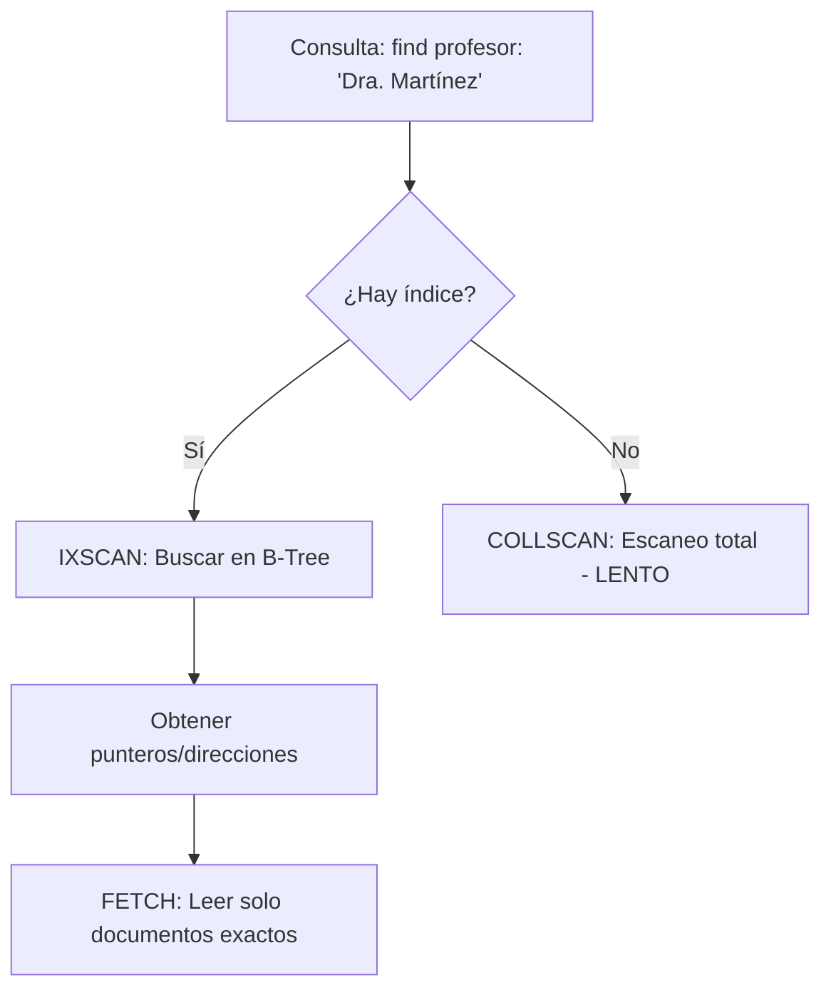

# 🚀 Índices y Rendimiento en MongoDB

Los índices son estructuras de datos especiales (**B-Trees**) que almacenan una pequeña parte del conjunto de datos de la colección de forma fácil de recorrer. Sin índices, MongoDB debe realizar un *Collection Scan* (recorrer cada documento), lo cual es lento e ineficiente.

---

## 🏗️ ¿Cómo funciona un índice?

Un índice mapea el `valor_del_campo` → `referencia_al_documento`.



---

## 📂 Tipos de Índices y Ejemplos

### 1. Single Field (Campo Único)
Índice más básico sobre un solo campo. Ideal para búsquedas directas.
```javascript
// Búsqueda rápida por nombre de usuario
db.usuarios.createIndex({ username: 1 }) // 1: Ascendente
```

### 2. Compound Index (Compuesto)
Índice sobre múltiples campos. **El orden es crítico.**
- **Regla ESR**: Equality (Igualdad), Sort (Orden), Range (Rango).
- **Regla del Prefijo**: Un índice `{ a, b, c }` sirve para `{a}` y `{a, b}`, pero no para `{b}` solo.

```javascript
// Optimiza consultas que filtran por ciudad y ordenan por edad
db.usuarios.createIndex({ ciudad: 1, edad: -1 })
```

### 3. Multikey Index
Para campos que contienen **arrays**. MongoDB crea una entrada de índice por cada elemento del array.
```javascript
// Para buscar rápidamente usuarios por sus intereses (array de strings)
// { "intereses": ["cocina", "tenis", "lectura"] }
db.usuarios.createIndex({ intereses: 1 })
```

### 4. Índices Especiales

#### 🕒 TTL (Time To Live)
Elimina documentos automáticamente tras un tiempo. Solo funciona en campos de tipo **fecha**.
```javascript
// Borrar logs automáticamente después de 1 hora (3600 segundos)
db.logs.createIndex({ createdAt: 1 }, { expireAfterSeconds: 3600 })
```

#### ☁️ Sparse (Disperso)
Solo indexa documentos que **contienen** el campo. Ahorra espacio en colecciones con campos opcionales.
```javascript
// Solo indexa a los usuarios que tengan cuenta de Twitter
db.usuarios.createIndex({ twitter_handle: 1 }, { sparse: true })
```

#### 📖 Text
Permite búsquedas de texto libre con tokenización. Solo puede haber **uno** por colección.
```javascript
// Búsqueda por palabras en título y descripción
db.articulos.createIndex({ titulo: "text", contenido: "text" })

// Uso: db.articulos.find({ $text: { $search: "mongodb tutorial" } })
```

#### 🔢 Hashed
Indexa el hash del valor. Ideal para **Sharding** (distribución uniforme de datos).
```javascript
// No sirve para rangos (> o <), solo para igualdad exacta
db.pedidos.createIndex({ pedidoId: "hashed" })
```

---

## 🛠️ Análisis de Rendimiento

Para saber si tus índices funcionan, usa `.explain()`:

```javascript
db.usuarios.find({ email: "test@example.com" }).explain("executionStats")
```

| Métrica | Qué buscar |
| :--- | :--- |
| **stage** | Busca `IXSCAN` (mejor) en lugar de `COLLSCAN`. |
| **nReturned** | Número de documentos devueltos. |
| **totalKeysExamined** | Debe ser lo más cercano posible a `nReturned`. |
| **totalDocsExamined** | Si es mucho mayor que `nReturned`, falta optimizar el índice. |

---

## ⚠️ Advertencias Profecionales

1. **Escrituras vs Lecturas**: Los índices aceleran las lecturas pero **ralentizan las escrituras** (cada índice debe actualizarse con cada `insert/update`).
2. **Memoria RAM**: Los índices deben caber en la RAM (*WiredTiger cache*) para ser efectivos.
3. **Selectividad**: Indexa campos con valores únicos o muy variados (alta cardinalidad).

---
**Enlaces Relacionados:**
*   [Operaciones CRUD](MongoDB-CRUD-Basics.md)
*   [Diseño de Esquemas Avanzado](MongoDB-Advanced-Modeling.md)
*   [Antipatrones de MongoDB](MongoDB-Antipatterns.md)

