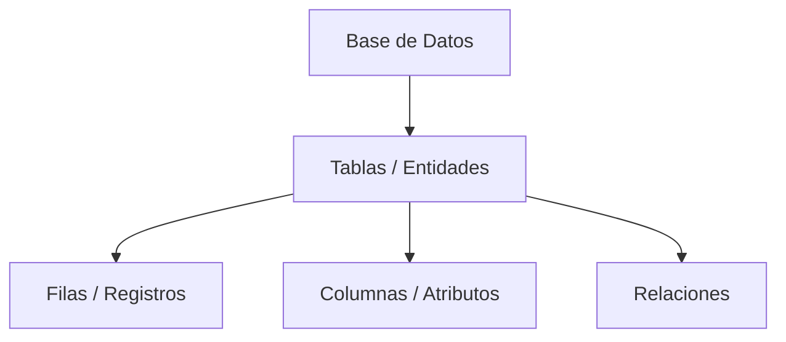
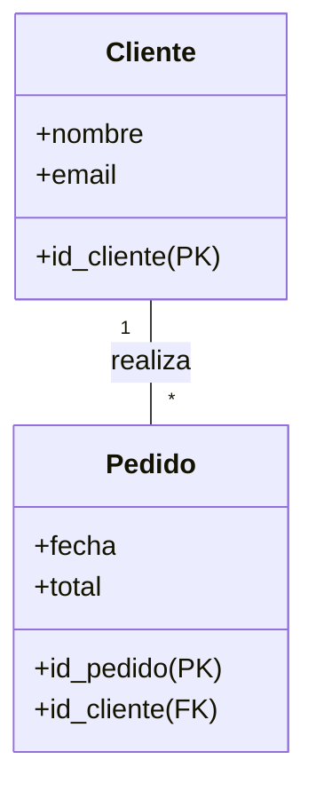

# Introducción a las Bases de Datos

## 1. ¿Qué es una Base de Datos?

Una **Base de Datos (BD)** es un conjunto **organizado de datos** que permite guardar, gestionar y recuperar información de manera eficiente. A diferencia de un sistema de archivos tradicional, una BD impone **estructuras y reglas** que garantizan la integridad y consistencia de los datos.

> [!NOTE]
> **Dato vs. Información**: El dato es la unidad mínima (ej. "25"), mientras que la información es el dato procesado y con contexto (ej. "Edad: 25 años").

### Estructura Básica
En el modelo más común (Relacional), la estructura se jerarquiza así:

---

## 2. Historia y Evolución

La evolución de las bases de datos ha sido impulsada por la necesidad de manejar volúmenes crecientes de información con mayor eficiencia.

| Era | Hito Principal | Características |
| :--- | :--- | :--- |
| **1960s** | **Modelos Jerárquicos y de Red** | Sistemas rígidos (IMS, CODASYL). Acceso complejo mediante punteros. |
| **1970s** | **Modelo Relacional** | **E.F. Codd** propone el modelo basado en tablas. Nace el concepto de independencia de datos. |
| **1980s** | **Dominio Relacional (SQL)** | Estandarización de SQL. Aparición de los grandes SGBD comerciales (Oracle, DB2). |
| **1990s** | **OODB y Data Warehousing** | Bases de datos orientadas a objetos y sistemas para análisis de datos (OLAP). |
| **2000s** | **Web y Big Data** | Explosión de datos por internet. Necesidad de escalabilidad horizontal. |
| **Actualidad** | **NoSQL y Cloud** | Bases flexibles (MongoDB, Redis), NewSQL y servicios gestionados en la nube. |

---

## 3. Tipos de Bases de Datos

Las bases de datos se pueden clasificar según diversos criterios:

### Por Uso
*   **Operacionales (OLTP)**: Optimizadas para transacciones diarias rápidas (ej. ventas, reservas).
*   **Analíticas (OLAP)**: Optimizadas para consultas complejas y análisis histórico (ej. Business Intelligence).

### Por Modelo de Datos
*   **Relacional**: Datos en tablas relacionadas. Estándar de la industria (SQL).
*   **NoSQL**:
    *   **Documental**: JSON/BSON (MongoDB).
    *   **Clave-Valor**: Alta velocidad (Redis).
    *   **Grafos**: Relaciones complejas (Neo4j).
    *   **Columnar**: Big Data (Cassandra).
*   **Jerárquico / Red**: Modelos legados.

### Por Ubicación
*   **Centralizadas**: Todo en un solo servidor.
*   **Distribuidas**: Datos repartidos en múltiples nodos (transparencia para el usuario).
*   **Cloud**: Alojadas y gestionadas por proveedores (AWS RDS, Azure SQL).

---

## 4. Modelos de Datos: Comparativa

El modelo define cómo se organizan lógicamente los datos.

### Archivos Planos vs. Modelo Relacional

**Archivos Planos** (ej. CSV, Excel):
*   Redundancia de datos.
*   Dificultad para mantener la integridad.
*   Dependencia del formato físico.

**Modelo Relacional**:
*   **Integridad**: Claves primarias y foráneas.
*   **No Redundancia**: Normalización.
*   **Independencia**: Separación entre lógica y física.

