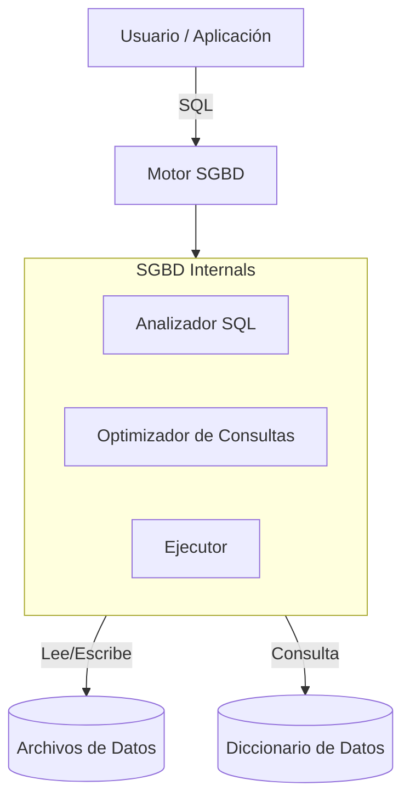

# Sistemas de Gestión de Bases de Datos (SGBD)

## 1. Definición y Funciones

Un **Sistema de Gestión de Bases de Datos (SGBD)** o *DBMS (Database Management System)* es el software que actúa como intermediario entre los usuarios/aplicaciones y los datos físicos.

**Funciones Principales:**
1.  **Definición de Datos (DDL)**: Crear y modificar estructuras (tablas, índices).
2.  **Manipulación de Datos (DML)**: Consultar, insertar, actualizar y borrar datos.
3.  **Control de Acceso (DCL)**: Gestión de usuarios y permisos.
4.  **Integridad y Consistencia**: Asegurar que los datos cumplan las reglas definidas.
5.  **Control de Concurrencia**: Permitir acceso simultáneo sin errores.
6.  **Recuperación y Respaldo**: Backup y restauración ante fallos.

### Arquitectura SGBD

---

## 2. Productos SGBD Populares

| Categoría | Ejemplos | Características |
| :--- | :--- | :--- |
| **Comerciales** | **Oracle Database** | Líder empresarial, robusto, costoso. |
| | **Microsoft SQL Server** | Integración total con ecosistema Windows/.NET. |
| | **IBM DB2** | Común en mainframes y grandes corporaciones. |
| **Open Source** | **PostgreSQL** | El más avanzado, cumple estándares SQL, extensible. |
| | **MySQL / MariaDB** | Muy popular en web (LAMP stack), rápido para lectura. |
| | **SQLite** | Base de datos embebida (móviles, apps de escritorio). |
| **NoSQL** | **MongoDB** | Documental, flexible, escalable. |
| | **Redis** | Clave-valor en memoria, caché de alto rendimiento. |

---

## 3. Las 12 Reglas de Codd

Edgar F. Codd definió estas reglas en 1985 para determinar si un SGBD es verdaderamente **Relacional**. Aunque pocos cumplen todas al 100%, son el estándar teórico.

> [!IMPORTANT]
> **Regla 0 (Fundacional)**: El sistema debe gestionar la base de datos **exclusivamente** a través de sus capacidades relacionales.

1.  **Información**: Todo dato debe representarse como un valor en una tabla.
2.  **Acceso Garantizado**: Todo dato es accesible mediante `NombreTabla + ClavePrimaria + NombreColumna`.
3.  **Tratamiento de Nulos**: El sistema debe soportar el valor `NULL` (desconocido/inaplicable) sistemáticamente.
4.  **Catálogo Dinámico**: La estructura de la BD se almacena en tablas del sistema consultables (`SELECT * FROM information_schema...`).
5.  **Sublenguaje Completo**: Debe existir un lenguaje (como SQL) que soporte DDL, DML, seguridad y transacciones.
6.  **Actualización de Vistas**: Las vistas teóricamente actualizables deben poder ser actualizadas por el sistema.
7.  **Inserción/Actualización/Borrado de Alto Nivel**: Operaciones sobre conjuntos de registros, no solo fila a fila.
8.  **Independencia Física**: Cambios en el almacenamiento (discos, índices) no afectan a las aplicaciones.
9.  **Independencia Lógica**: Cambios en el esquema (añadir columnas) no afectan a las aplicaciones (si no usan esa columna).
10. **Independencia de Integridad**: Las restricciones (PK, FK) se definen en la BD, no en la aplicación.
11. **Independencia de Distribución**: El usuario no debe saber si la BD está centralizada o distribuida.
12. **No Subversión**: No debe existir una vía de bajo nivel para saltarse las reglas de integridad.
