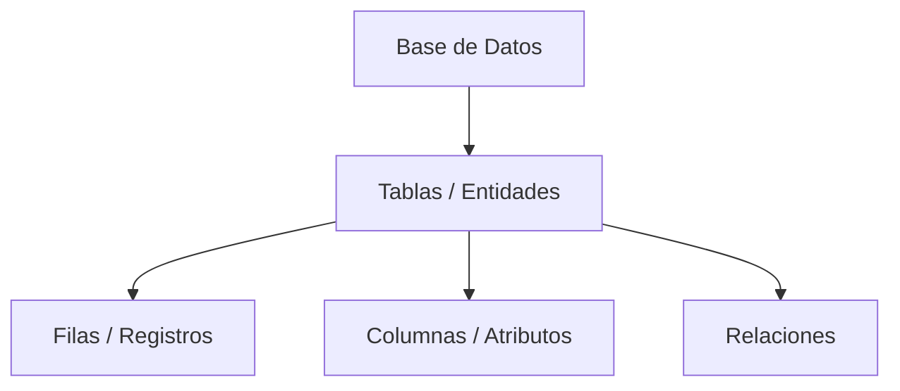

# Definición de Base de Datos

Una **Base de Datos (BD)** es un conjunto **organizado de datos** que permite guardar, gestionar y recuperar información de manera eficiente.

A diferencia de un sistema de archivos tradicional, una BD impone **estructuras y reglas** que garantizan la integridad y consistencia de los datos.

## Estructura Básica
En el modelo más común ([[Modelo_Relacional_Conceptos]]), la estructura se jerarquiza así:

## Relacionado
*   Gestionado por: [[SGBD_Definicion]]
*   Tipos: [[Tipos_de_Bases_de_Datos]]
*   Historia: [[Historia_Bases_de_Datos]]

---
[[00_MOC_Introduccion]]
