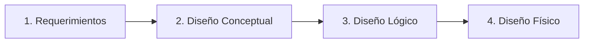
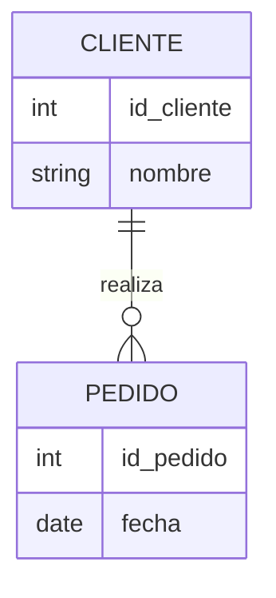
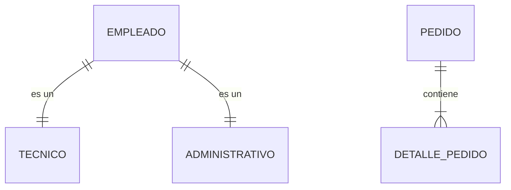

# Metodología de Diseño de Bases de Datos

El diseño de una base de datos es un proceso estructurado que permite transformar los requerimientos de información de una organización en un esquema de base de datos funcional y eficiente.

## 1. Fases del Diseño

El proceso se divide en cuatro fases principales:

1.  **Recolección y Análisis de Requerimientos**: Entender qué datos necesita el sistema y cómo se relacionan.
2.  **Diseño Conceptual**: Crear un esquema independiente del SGBD (Modelo Entidad-Relación).
3.  **Diseño Lógico**: Transformar el esquema conceptual a un modelo de datos específico (Modelo Relacional).
4.  **Diseño Físico**: Implementar el esquema en un SGBD concreto (MySQL, Oracle), definiendo índices, almacenamiento, etc.

---

## 2. Modelo Entidad-Relación (ER)

El Modelo ER es la herramienta estándar para el diseño conceptual. Permite representar la realidad mediante tres elementos básicos:

### Elementos Básicos

*   **Entidad**: Objeto del mundo real (físico o abstracto) sobre el cual queremos guardar información.
    *   *Ejemplo*: `Cliente`, `Producto`, `Pedido`.
*   **Atributo**: Característica o propiedad de una entidad.
    *   *Ejemplo*: `nombre`, `precio`, `fecha`.
    *   **Identificador (PK)**: Atributo que distingue a cada instancia de la entidad.
*   **Relación**: Asociación entre dos o más entidades.
    *   *Ejemplo*: Un `Cliente` *compra* un `Producto`.

### Cardinalidad

Define cuántas instancias de una entidad pueden relacionarse con instancias de otra.

| Tipo | Descripción | Ejemplo |
| :--- | :--- | :--- |
| **1:1 (Uno a Uno)** | Una entidad se relaciona con una única entidad. | `Usuario` tiene un `Perfil`. |
| **1:N (Uno a Muchos)** | Una entidad se relaciona con muchas, pero la otra solo con una. | `Cliente` realiza muchos `Pedidos`. |
| **N:M (Muchos a Muchos)** | Ambas entidades pueden relacionarse con múltiples instancias de la otra. | `Estudiante` cursa muchas `Asignaturas`. |

### Diagrama ER Simple

---

## 3. Modelo ER Extendido (EER)

Para situaciones más complejas, el modelo se extiende con nuevos conceptos:

### Generalización / Especialización (Herencia)
Permite crear jerarquías de entidades. Una **Superclase** agrupa atributos comunes, y las **Subclases** tienen atributos específicos.

*   *Ejemplo*: `Empleado` (Superclase) puede ser `Técnico` o `Administrativo` (Subclases).

### Entidades Débiles
Entidades que no pueden existir sin una entidad fuerte de la cual dependen. Su identificador suele formarse combinando su clave parcial con la clave de la entidad fuerte.

*   *Ejemplo*: `DetallePedido` depende de `Pedido`. Si borras el pedido, los detalles no tienen sentido.

### Atributos Multivalorados
Atributos que pueden tener múltiples valores para una misma entidad.

*   *Ejemplo*: `Teléfono` de un cliente (puede tener fijo, móvil, trabajo). En el modelo relacional, esto suele convertirse en una tabla aparte.

