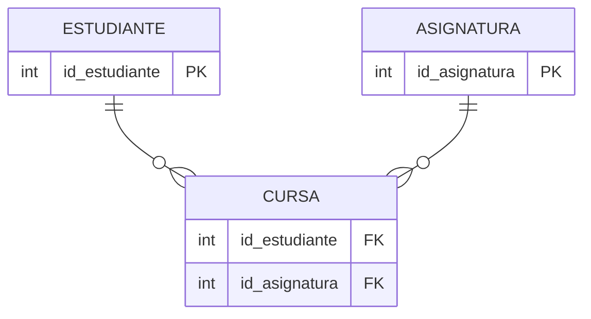

# Modelo Relacional

El **Modelo Relacional**, propuesto por E.F. Codd en 1970, es la base de la mayoría de los SGBD modernos. Se basa en la teoría matemática de conjuntos y relaciones.

## 1. Conceptos Fundamentales

En este modelo, todos los datos se representan en **Tablas** (matemáticamente llamadas *Relaciones*).

*   **Tabla (Relación)**: Conjunto de datos organizados en filas y columnas.
*   **Tupla (Fila)**: Representa un registro único (una instancia de la entidad).
*   **Atributo (Columna)**: Representa una propiedad de la entidad.
*   **Dominio**: Conjunto de valores válidos para un atributo (ej. enteros, fechas).

### Claves (Keys)

*   **Clave Primaria (PK - Primary Key)**: Uno o más atributos que identifican de forma **única** a cada tupla en una tabla. No puede ser `NULL`.
*   **Clave Foránea (FK - Foreign Key)**: Atributo que hace referencia a la Clave Primaria de otra tabla. Es el mecanismo para establecer **relaciones** entre tablas.

---

## 2. Transformación: De ER a Relacional

El paso del Diseño Conceptual (ER) al Lógico (Relacional) sigue reglas precisas:

### Regla 1: Entidades Fuertes
Cada entidad fuerte se convierte en una **Tabla**. Sus atributos simples pasan a ser columnas. El identificador pasa a ser la **PK**.

### Regla 2: Relaciones 1:N
Se propaga la clave. La PK del lado "1" pasa como **FK** a la tabla del lado "N".

*   *Ejemplo*: `Cliente (1) -- (N) Pedido`.
*   En la tabla `Pedido` agregamos `id_cliente` como FK.

### Regla 3: Relaciones N:M
Se crea una **Nueva Tabla Intermedia**.
*   Esta tabla tendrá como FKs las PKs de las dos entidades relacionadas.
*   La PK de la nueva tabla suele ser la composición de ambas FKs.
*   Si la relación tenía atributos propios (ej. `nota` en `Estudiante-Asignatura`), estos van a la tabla intermedia.

### Regla 4: Relaciones 1:1
Se puede propagar la clave de cualquiera de las dos tablas a la otra (como FK), preferiblemente a la que tenga participación total (obligatoria). O a veces se fusionan las tablas si son muy dependientes.

### Regla 5: Atributos Multivalorados
Se crea una **Nueva Tabla** para el atributo, vinculada por FK a la entidad original.

---

## 3. Ejemplo Visual de Transformación

**Modelo ER (N:M):**
`Estudiante` <--- *Cursa* ---> `Asignatura`

**Modelo Relacional (Tablas):**

1.  **Tabla ESTUDIANTE**: `id_estudiante (PK)`, `nombre`.
2.  **Tabla ASIGNATURA**: `id_asignatura (PK)`, `nombre`.
3.  **Tabla CURSA** (Intermedia):
    *   `id_estudiante (FK)`
    *   `id_asignatura (FK)`
    *   `PK compuesta: (id_estudiante, id_asignatura)`

