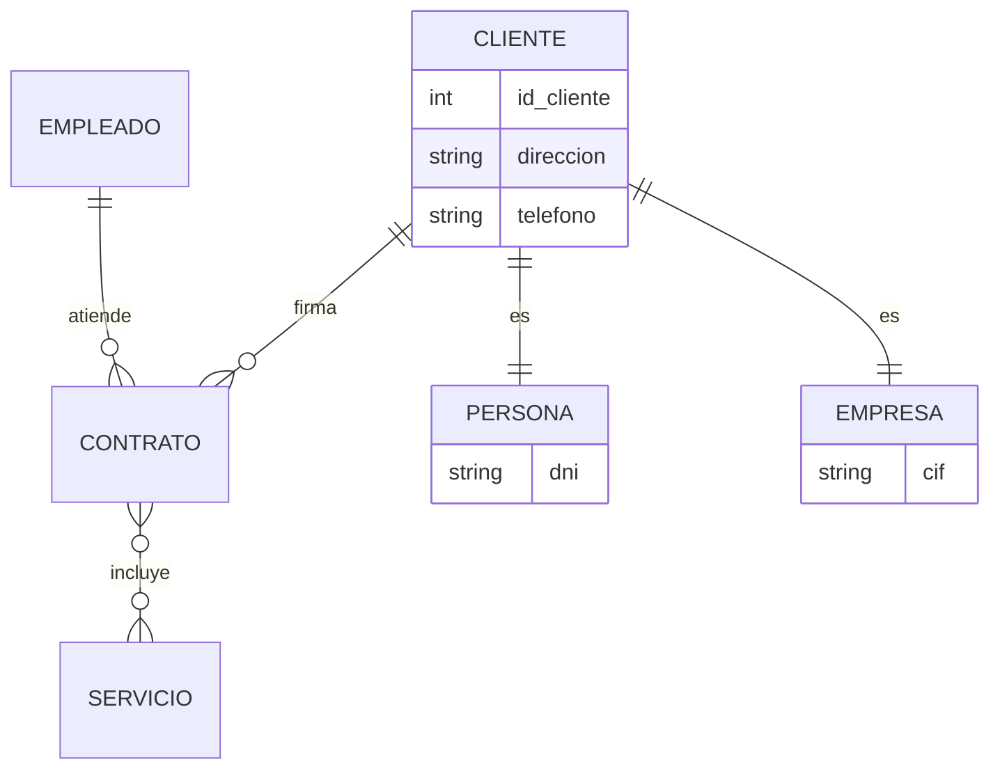
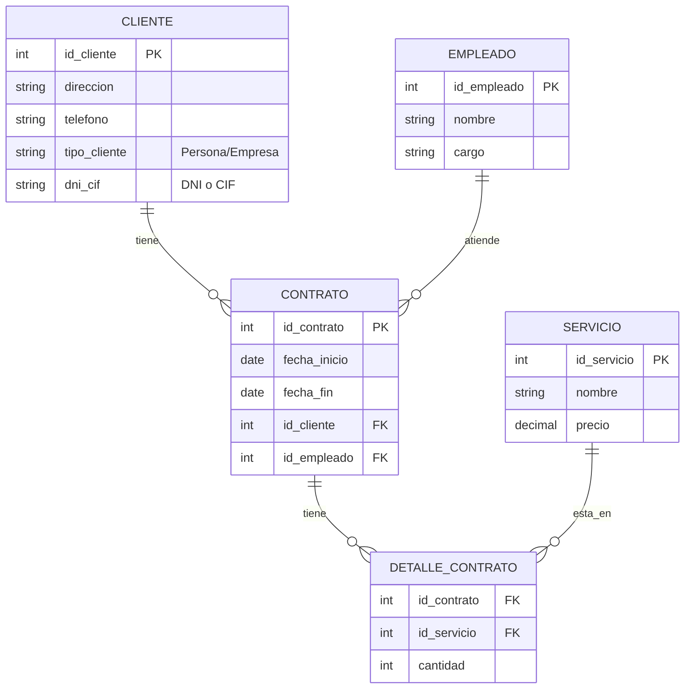

# Caso de Estudio: Empresa de Servicios

Este caso práctico ilustra el proceso completo de diseño de una base de datos, desde los requerimientos hasta el esquema relacional final.

## 1. Requerimientos

Una empresa de servicios necesita un sistema para gestionar sus contratos.
*   **Clientes**: Pueden ser Personas o Empresas. Contratan servicios.
*   **Servicios**: Tienen diferentes tipos y precios.
*   **Contratos**: Un cliente firma un contrato que incluye uno o varios servicios. Tienen fecha de inicio y fin.
*   **Empleados**: Atienden los contratos. Pueden ser Técnicos o Administrativos.

---

## 2. Diseño Conceptual (Modelo ER)

### Identificación de Entidades y Relaciones
*   **Jerarquías**:
    *   `Cliente` se especializa en `Persona` y `Empresa`.
    *   `Empleado` se especializa en `Técnico` y `Administrativo`.
*   **Relaciones**:
    *   `Cliente` --(1:N)--> `Contrato` (Un cliente tiene muchos contratos).
    *   `Empleado` --(1:N)--> `Contrato` (Un empleado atiende muchos contratos).
    *   `Contrato` --(N:M)--> `Servicio` (Un contrato tiene muchos servicios, un servicio está en muchos contratos).

### Diagrama ER

---

## 3. Diseño Lógico (Modelo Relacional)

Aplicamos las reglas de transformación para obtener las tablas finales.

### Transformación de Jerarquías
Para `Cliente`, usaremos la estrategia de **Tabla Única** (por simplicidad en este caso), añadiendo columnas para los atributos específicos y un discriminador, o bien tablas separadas si son muy distintos. Aquí asumiremos tablas separadas vinculadas por la misma PK.

### Transformación de Relaciones N:M
La relación entre `Contrato` y `Servicio` es N:M, por lo que creamos la tabla intermedia `DETALLE_CONTRATO`.

### Esquema Relacional Final

### Tablas Resultantes

1.  **CLIENTE**: `id_cliente (PK)`, `direccion`, `telefono`, `dni_cif`.
2.  **EMPLEADO**: `id_empleado (PK)`, `nombre`, `cargo`.
3.  **SERVICIO**: `id_servicio (PK)`, `nombre`, `precio`.
4.  **CONTRATO**: `id_contrato (PK)`, `fecha_inicio`, `fecha_fin`, `id_cliente (FK)`, `id_empleado (FK)`.
5.  **DETALLE_CONTRATO**: `id_contrato (FK)`, `id_servicio (FK)`, `cantidad`. **PK Compuesta**: `(id_contrato, id_servicio)`.
