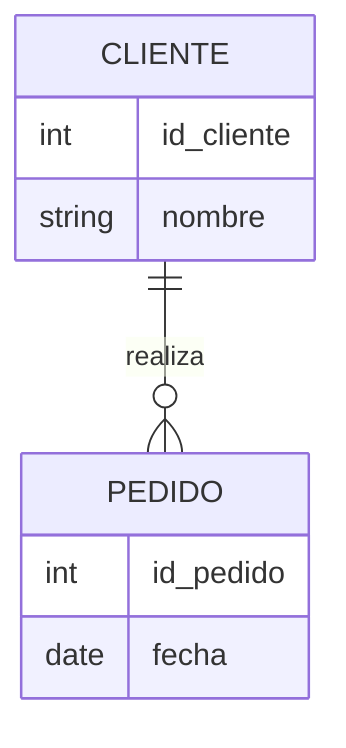

# Modelo Entidad-Relación (ER)

El Modelo ER es la herramienta estándar para el diseño conceptual ([Fases del Diseño BD](Fases_del_Dise%C3%B1o_BD.md)). Permite representar la realidad mediante tres elementos básicos:

*   [Entidad](Entidad.md)
*   [Atributo](Atributo.md)
*   [Relacion ER](Relacion_ER.md)

## Diagrama ER Simple

---
[00 MOC Diseño](00_MOC_Dise%C3%B1o.md)
