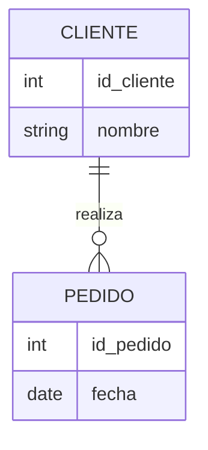

# Modelo Entidad-Relación (ER)

El Modelo ER es la herramienta estándar para el diseño conceptual ([[Fases_del_Diseño_BD]]). Permite representar la realidad mediante tres elementos básicos:

*   [[Entidad]]
*   [[Atributo]]
*   [[Relacion_ER]]

## Diagrama ER Simple

---
[[00_MOC_Diseño]]
