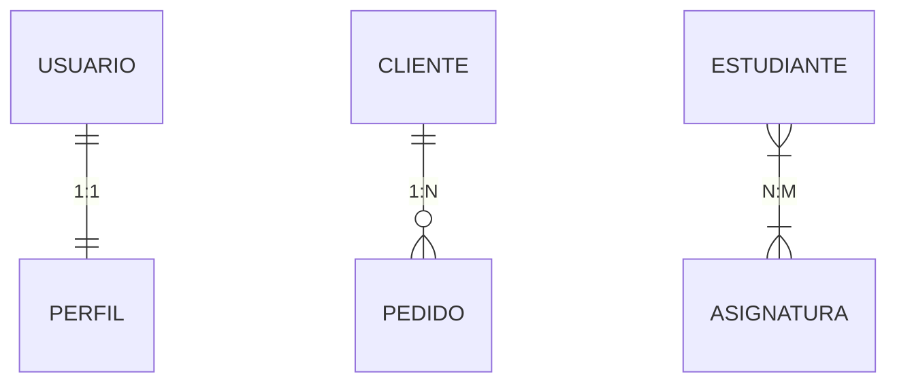

# Relación (ER)

Una **Relación** es una asociación entre dos o más entidades. Describe cómo interactúan.

*   *Ejemplo*: Un `Cliente` *compra* un `Producto`.

## Cardinalidad
Define cuántas instancias de una entidad pueden relacionarse con instancias de otra.

| Tipo | Descripción | Ejemplo |
| :--- | :--- | :--- |
| **1:1 (Uno a Uno)** | Una entidad se relaciona con una única entidad. | `Usuario` tiene un `Perfil`. |
| **1:N (Uno a Muchos)** | Una entidad se relaciona con muchas, pero la otra solo con una. | `Cliente` realiza muchos `Pedidos`. |
| **N:M (Muchos a Muchos)** | Ambas entidades pueden relacionarse con múltiples instancias de la otra. | `Estudiante` cursa muchas `Asignaturas`. |

---
## 📝 Ejercicios de Práctica

1.  **Gimnasio**: Un `Socio` puede asistir a muchas `Clases`, y una `Clase` puede tener muchos `Socios`.
    *   *Solución*: **N:M**. Requiere tabla intermedia.
2.  **Coche**: Un `Coche` tiene un único `Motor`, y un `Motor` pertenece a un único `Coche`.
    *   *Solución*: **1:1**.
3.  **Hospital**: un `Médico` atiende a muchos `Pacientes`, pero cada `Paciente` tiene un único médico asignado.
    *   *Solución*: **1:N**.

---
[Modelo Entidad Relacion](Modelo_Entidad_Relacion.md)
