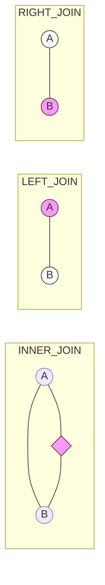

# SQL JOIN

Vincula datos de múltiples tablas.

## Tipos
*   **INNER JOIN**: Solo filas que coinciden en ambas.
*   **LEFT JOIN**: Todas las de la izquierda + coincidentes derecha.
*   **RIGHT JOIN**: Todas las de la derecha.




## Ejemplo
```sql
SELECT c.nombre, p.total
FROM cliente c
INNER JOIN pedido p ON c.id = p.id_cliente;
```

---
## 📝 Ejercicios de Práctica

Dadas las tablas: `Autores` (id, nombre) y `Libros` (id, titulo, id_autor).

1.  **Consulta**: Obtener todos los libros y el nombre de su autor. Solo si el libro tiene autor asignado.
    *   *Solución*: `SELECT L.titulo, A.nombre FROM Libros L INNER JOIN Autores A ON L.id_autor = A.id;`
2.  **Consulta**: Obtener todos los autores y sus libros, incluyendo aquellos autores que aún no han publicado ningún libro.
    *   *Solución*: `SELECT A.nombre, L.titulo FROM Autores A LEFT JOIN Libros L ON A.id = L.id_autor;`
3.  **Consulta**: Buscar libros que no tengan autor asignado (huérfanos).
    *   *Solución*: `SELECT titulo FROM Libros WHERE id_autor IS NULL;`

---
[SELECT Basico](SELECT_Basico.md)
