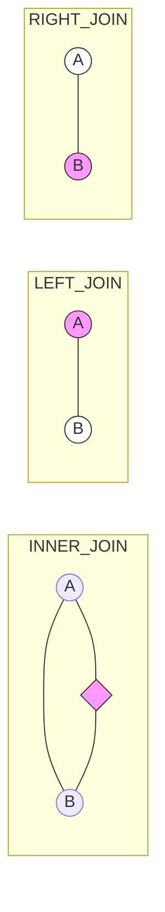

# SQL JOIN

Vincula datos de múltiples tablas.

## Tipos
*   **INNER JOIN**: Solo filas que coinciden en ambas.
*   **LEFT JOIN**: Todas las de la izquierda + coincidentes derecha.
*   **RIGHT JOIN**: Todas las de la derecha.




## Ejemplo
```sql
SELECT c.nombre, p.total
FROM cliente c
INNER JOIN pedido p ON c.id = p.id_cliente;
```

---
[SELECT Basico](SELECT_Basico.md)
