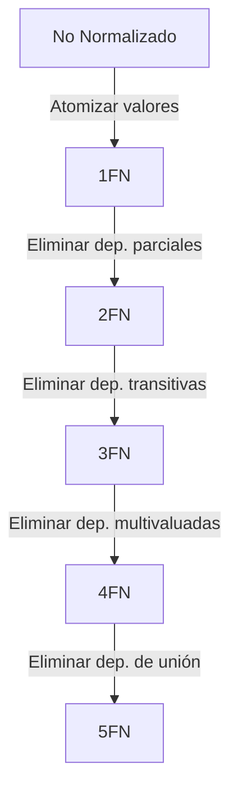

# Normalización: Conceptos Básicos

La **Normalización** es el proceso de organizar los datos en una base de datos para **reducir la redundancia** y **mejorar la integridad**.

## Objetivos
1.  **Eliminar redundancia**: Evitar guardar el mismo dato en múltiples lugares.
2.  **Evitar anomalías**:
    *   **Inserción**: No poder insertar un dato porque falta otro (ej. no poder crear un curso si no tiene alumnos).
    *   **Actualización**: Tener que actualizar múltiples filas para cambiar un solo dato (ej. cambiar la dirección de un cliente en 100 pedidos).
    *   **Borrado**: Perder información accidentalmente al borrar una fila (ej. borrar el último alumno de un curso y perder los datos del curso).

## Dependencias Funcionales

Una **Dependencia Funcional (DF)** es una restricción entre dos conjuntos de atributos de una tabla.

Se denota como $X \to Y$ ("X determina a Y").
Significa que si conocemos el valor de $X$, podemos conocer el valor único de $Y$.

*   **Dependencia Total**: $Y$ depende de toda la clave primaria $X$.
*   **Dependencia Parcial**: $Y$ depende solo de una parte de la clave primaria compuesta $X$.
*   **Dependencia Transitiva**: $X \to Y$ y $Y \to Z$. $Z$ depende transitivamente de $X$.
*   **Dependencia Multivaluada**: $X$ determina un *conjunto* de valores de $Y$ independiente de otros atributos.

---

## Proceso de Normalización

El proceso se realiza aplicando una serie de reglas llamadas **Formas Normales (FN)**. Cada forma normal asume que se cumplen las anteriores.

