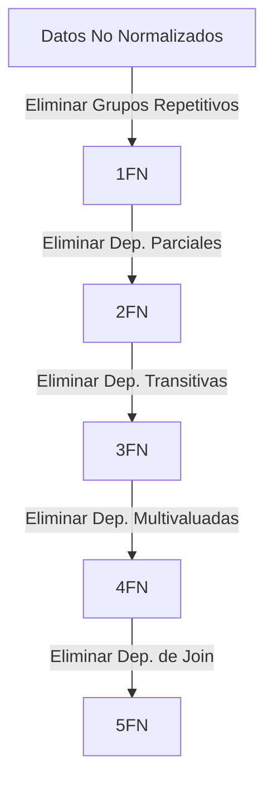

# Resumen de Niveles de Normalización

La normalización es un proceso progresivo. Cada nivel (Forma Normal) implica que se cumplen todas las reglas de los niveles anteriores.

## Tabla Comparativa

| Forma Normal                     | Objetivo Principal    | Problema que Elimina                                                 | Regla Clave                                                                         |
| :------------------------------- | :-------------------- | :------------------------------------------------------------------- | :---------------------------------------------------------------------------------- |
| **[[Primera_Forma_Normal_1FN]]** | **Atomicidad**        | Grupos repetitivos y atributos compuestos.                           | Cada celda debe tener un solo valor.                                                |
| **[[Segunda_Forma_Normal_2FN]]** | **Dependencia Total** | Dependencia Parcial (Atributo no clave depende de *parte* de la PK). | Todo atributo no clave depende de *toda* la PK.                                     |
| **[[Tercera_Forma_Normal_3FN]]** | **Independencia**     | Dependencia Transitiva (Atributo no clave depende de otro no clave). | Ningún atributo no clave depende de otro atributo no clave.                         |
| **[[Cuarta_Forma_Normal_4FN]]**  | **Desacoplamiento**   | Dependencia Multivaluada (MVD) independiente.                        | Separar hechos independientes que ocurren sobre la misma entidad.                   |
| **[[Quinta_Forma_Normal_5FN]]**  | **Reconstrucción**    | Dependencia de Join (JD).                                            | Evitar pérdidas de información o tuplas espurias al descomponer relaciones N-arias. |

## Resumen Visual

## ¿Hasta dónde normalizar?
*   **3FN** es el estándar industrial. Es suficiente para la mayoría de las bases de datos de negocio, garantizando un buen equilibrio entre integridad y rendimiento.
*   **4FN y 5FN** son necesarias en casos complejos de diseño lógico donde existen relaciones multivaluadas independientes o dependencias cíclicas complejas.

---
[[00_MOC_Normalizacion]]
