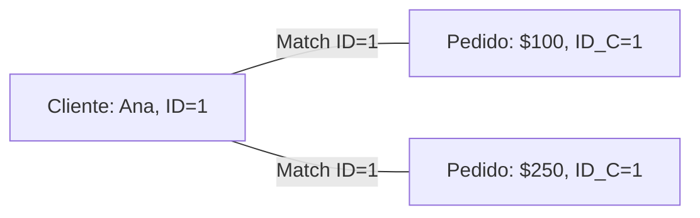

# Álgebra Relacional: Operadores Derivados

Estos operadores se pueden construir combinando los fundamentales, pero se definen por separado por su uso frecuente.

## 1. Intersección ($\cap$)
Devuelve las tuplas que están presentes en **ambas** relaciones.
*   **Sintaxis**: $R \cap S$
*   **Equivalencia**: $R - (R - S)$
*   **SQL equivalente**: `INTERSECT`

| R1 (Clientes 2023) | R2 (Clientes 2024) | R1 $\cap$ R2 (Fieles) |
| :--- | :--- | :--- |
| Ana | Marta | **Marta** |
| Luis | Jorge | |
| Marta | | |

## 2. Join / Reunión ($\bowtie$)
Combina tuplas de dos relaciones basándose en una condición común. Es la operación más importante para vincular datos.

### Join Natural ($\bowtie$)
Une tablas por igualdad en atributos con el mismo nombre.
*   **Sintaxis**: $R \bowtie S$

### Theta Join ($\bowtie_{\theta}$)
Une tablas basándose en una condición explícita (ej. $A > B$).
*   **Sintaxis**: $R \bowtie_{condición} S$

**Ejemplo Visual**:
`CLIENTE` $\bowtie$ `PEDIDO`

## 3. División ($\div$)
Operador "para todos". Devuelve las tuplas de R que están relacionadas con **todas** las tuplas de S.

*   **Sintaxis**: $R \div S$
*   **Uso típico**: "¿Qué estudiantes han aprobado **todas** las asignaturas obligatorias?"

**Ejemplo**:
*   $R$: Estudiante-Asignatura (Quién aprobó qué)
*   $S$: Asignaturas Obligatorias (Matemáticas, Física)
*   $R \div S$: Estudiantes que aprobaron Matemáticas **Y** Física.

| Estudiante | Asignatura |
| :--- | :--- |
| Ana | Mat |
| Ana | Fis |
| Luis | Mat |

Si $S = \{Mat, Fis\}$, entonces $R \div S = \{Ana\}$. (Luis no, porque le falta Física).
