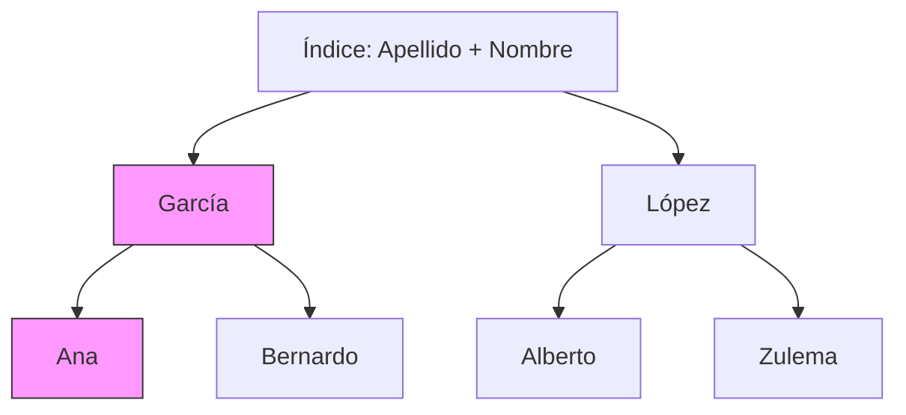

# Índices Compuestos

Un índice compuesto (o multinivel) es un índice que se construye sobre dos o más columnas de una misma tabla.

## Regla de Izquierda a Derecha

MySQL recorre los índices compuestos estrictamente de izquierda a derecha. Para entenderlo, piensa en una **Guía Telefónica** ordenada por: `Apellido` > `Nombre` > `Dirección`.

- **Puedes buscar** a alguien si sabes el `Apellido`.
- **Puedes ser más veloz** si sabes `Apellido` y `Nombre`.
- **NO puedes buscar** nada si solo sabes el `Nombre` (tendrías que leer toda la guía).



### Reglas Clave:
1. Las columnas buscadas con `=` deben aparecer primero.
2. El índice se puede usar hasta que se encuentra una columna con una condición de **rango** (`> < BETWEEN LIKE 'x%'`).
3. Después de un rango, las columnas posteriores del índice ya no pueden usarse para filtrar ni para ordenar.


## El Caso Ideal (Perfect Match)
Para una consulta con:
- Filtros exactos (`=`) en varias columnas.
- Un filtro de rango o un `ORDER BY` al final.

**Ejemplo**:
```sql
INDEX (pais, tipo_usuario, fecha_pedido)
```
Funciona perfectamente para:
```sql
WHERE pais = 'ES' AND tipo_usuario = 'Premium' ORDER BY fecha_pedido DESC
```

## Errores Comunes
- **Saltarse el primer campo**: Si el índice empieza por `pais` y buscas solo por `tipo_usuario`, el índice es "invisible" para el optimizador.
- **Rango prematuro**: Poner una columna de rango al principio del índice inhabilita el resto de las columnas para filtrado eficiente.

---
## 📝 Ejercicios de Práctica

Dado el índice: `INDEX (apellido, nombre, edad)`

1.  **Consulta**: `SELECT * FROM personas WHERE apellido = 'Ruiz' AND nombre = 'Ana';`
    *   *¿Usa el índice?*: **Sí**, usa las dos primeras columnas.
2.  **Consulta**: `SELECT * FROM personas WHERE nombre = 'Ana';`
    *   *¿Usa el índice?*: **No**, se salta la primera columna (`apellido`).
3.  **Consulta**: `SELECT * FROM personas WHERE apellido = 'Ruiz' AND edad = 25;`
    *   *¿Usa el índice?*: **Parcialmente**. Solo filtra por `apellido`. No puede usar `edad` porque falta `nombre` en medio.
4.  **Consulta**: `SELECT * FROM personas WHERE apellido = 'Ruiz' AND nombre LIKE 'A%' AND edad = 25;`
    *   *¿Usa el índice?*: **Parcialmente**. Filtra por `apellido` y el rango en `nombre`. La `edad` se ignora por estar después del rango.

---
- **Relacionado**: [Query Optimization](Query_Optimization.md), [[03_SQL/Constraints_SQL]]
