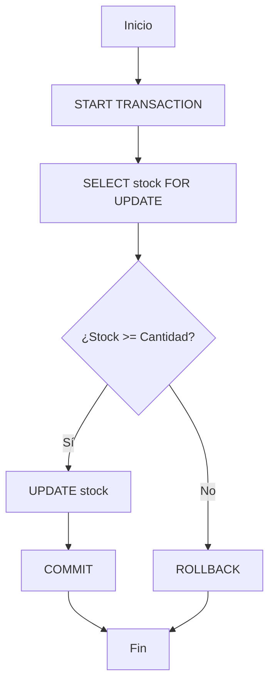

# Ejemplos de Scripts y Programación

A continuación se presentan patrones comunes de scripts SQL para resolver problemas de negocio y mantenimiento.

## 1. Venta con Control de Stock
Este patrón asegura que no se venda más de lo que hay disponible mediante el uso de transacciones y bloqueos.




```sql
CREATE PROCEDURE realizar_venta(IN p_id_prod INT, IN p_cantidad INT)
BEGIN
    DECLARE v_stock INT;
    START TRANSACTION;
    
    SELECT stock INTO v_stock FROM productos WHERE id_prod = p_id_prod FOR UPDATE;
    
    IF v_stock >= p_cantidad THEN
        UPDATE productos SET stock = stock - p_cantidad WHERE id_prod = p_id_prod;
        COMMIT;
    ELSE
        ROLLBACK;
    END IF;
END;
```

## 2. Transferencia Bancaria Segura
Uso de transacciones para asegurar el movimiento de fondos entre dos cuentas.

```sql
CREATE PROCEDURE transferencia(IN c_origen INT, IN c_destino INT, IN monto DECIMAL)
BEGIN
    START TRANSACTION;
    -- Restar de origen
    UPDATE cuentas SET saldo = saldo - monto WHERE id_cuenta = c_origen;
    -- Sumar a destino
    UPDATE cuentas SET saldo = saldo + monto WHERE id_cuenta = c_destino;
    
    -- Lógica de validación (ej. saldo no negativo)
    IF (SELECT saldo FROM cuentas WHERE id_cuenta = c_origen) < 0 THEN
        ROLLBACK;
    ELSE
        COMMIT;
    END IF;
END;
```

## 3. Poblado Masivo de Datos
Uso de bucles `WHILE` para generar datos de prueba de forma eficiente.

```sql
WHILE i < total_objetivo DO
    INSERT INTO tabla (columna) VALUES (CONCAT('dato_', i));
    SET i = i + 1;
END WHILE;
```

---
- **Relacionado**: [Control de Transacciones](Transacciones_Control.md), [Control de Flujo](Control_de_Flujo.md)
