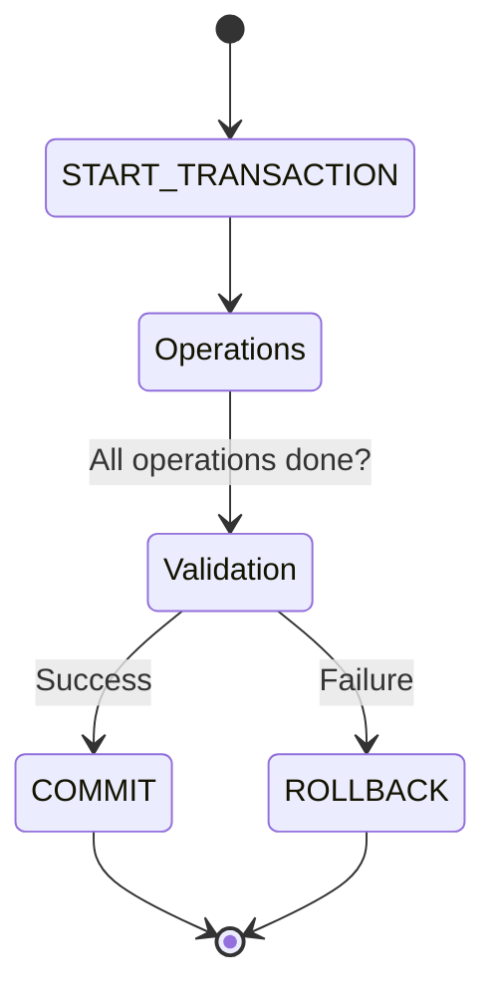

# Control de Transacciones


Una transacción es una unidad lógica de trabajo que debe completarse en su totalidad o no hacerse en absoluto (Propiedades ACID). En la programación de scripts, el control de transacciones es vital para mantener la integridad de los datos.

## Comandos Principales

- **START TRANSACTION**: Inicia un nuevo bloque transaccional.
- **COMMIT**: Guarda permanentemente todos los cambios realizados desde el inicio de la transacción.
- **ROLLBACK**: Revierte todos los cambios realizados, devolviendo la base de datos al estado anterior al inicio de la transacción.




## Puntos de Guardado (SAVEPOINT)

Permiten realizar retrocesos parciales sin cancelar toda la transacción.

```sql
START TRANSACTION;
-- Operación A
SAVEPOINT punto_1;

-- Operación B
SAVEPOINT punto_2;

-- Si B falla pero quiero mantener A:
ROLLBACK TO punto_1;

COMMIT; -- Confirma solo las operaciones hasta el punto_1
```

## Bloqueo de Filas (FOR UPDATE)
Dentro de una transacción, se puede bloquear una fila para evitar que otros procesos la modifiquen mientras se decide si confirmar o revertir.
```sql
SELECT stock INTO stock_actual 
FROM producto 
WHERE id_producto = 1 
FOR UPDATE;
```

---
## 📝 Ejercicios de Práctica

**Completa el Script**: Queremos restar 50€ de la `cuenta_1` y sumarlos a la `cuenta_2`. Si la `cuenta_1` se queda en negativo, debemos cancelar todo.

```sql
__________ TRANSACTION;

UPDATE cuentas SET saldo = saldo - 50 WHERE id = 1;
UPDATE cuentas SET saldo = saldo + 50 WHERE id = 2;

IF (SELECT saldo FROM cuentas WHERE id = 1) < 0 THEN
    __________;
ELSE
    __________;
END IF;
```

**Solución**:
1. `START`
2. `ROLLBACK`
3. `COMMIT`

---
- **Relacionado**: [[05_Transacciones/Propiedades ACID]], [Ejemplos](Ejemplos_Programacion.md)
