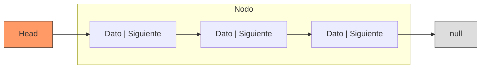

# Lista Enlazada Simple (Singly Linked List)

Una **Lista Enlazada Simple** es una estructura de datos lineal compuesta por **nodos**. Cada nodo almacena un dato y un puntero (referencia) al siguiente elemento en la secuencia, terminando en un valor `null`.

## Estructura Visual



## Representación en Código (Java)

> [!NOTE]
> La simplicidad de esta estructura permite una implementación ligera, ideal para cuando no se conoce el tamaño total de los datos de antemano.

```java
class Nodo() {
    Nodo siguiente;
    ó
    Nodo anterior;
}

class ListaEnlazada {
    Nodo primerNodo;
}
```

## Complejidad Big O

| Operación | Complejidad | Notas |
| :--- | :--- | :--- |
| **Inserción** | $O(1)$ | Si es en el inicio (`head`). $O(n)$ si es al final o por índice. |
| **Edición** | $O(n)$ | Requiere búsqueda lineal del nodo. |
| **Eliminación**| $O(1)$ | Si es en el inicio. $O(n)$ si se requiere buscar el nodo anterior. |
| **Peek** | $O(n)$ | El acceso por índice requiere un recorrido secuencial. |

## Atributos Clave
- **Crecimiento Dinámico**: No requiere redimensionamiento manual como los arrays.
- **Acceso Secuencial**: No permite acceso aleatorio; para llegar al nodo $i$, hay que pasar por los $i-1$ anteriores.
- **Eficiencia de Memoria**: Gasta más memoria por elemento que un array (por el puntero), pero no reserva espacio contiguo innecesario.

---
[Regresar al MOC](00_MOC_Lineales.md)
