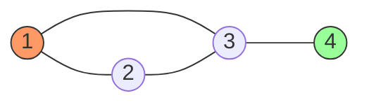

# Grafos (Graphs)

Un **Grafo** es una estructura de datos no lineal compuesta por un conjunto de **Vértices** (o nodos) y un conjunto de **Aristas** (o arcos) que conectan pares de vértices. Formalmente se define como $G = (V, E)$.

## Tipos de Grafos

```mermaid
graph TD
    A[Tipos de Grafos] --> B["Dirigidos (Digrafos)"]
    A --> C[No Dirigidos]
    A --> D[Pesados (con pesos en aristas)]
    A --> E[Acíclicos (DAGs)]
```

### Características Principales
1. **Relaciones N:M**: A diferencia de los árboles, un nodo puede estar conectado a cualquier número de otros nodos.
2. **Ciclos**: Pueden contener caminos que regresan al punto de origen.
3. **Conectividad**: Un grafo puede estar conectado (un camino entre cualquier par de nodos) o desconectado.

## Representación Visual



## Formas de Implementación
Para manejar los grafos en código, existen dos representaciones fundamentales:
- **Matriz de Adyacencia**: Una tabla de $V \times V$ donde el valor indica si hay conexión.
- **Lista de Adyacencia**: Un array de listas donde cada posición contiene los vecinos de un vértice.

---
[Regresar al MOC](00_MOC_Grafos.md)
