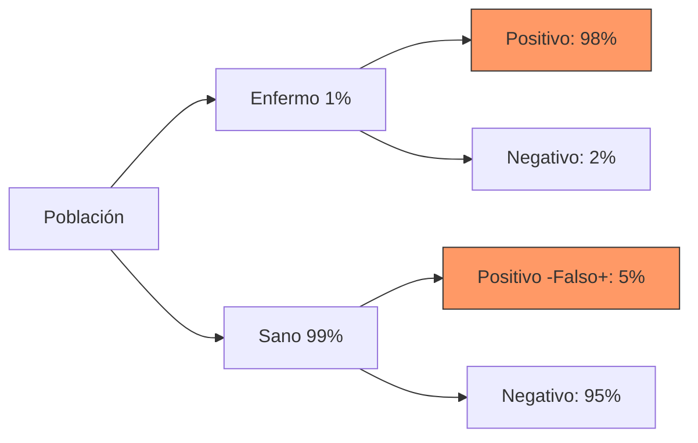

# Solucionario: Simulacro de Examen - Modelo A

Este documento contiene la resolución detallada del simulacro de examen, siguiendo los procedimientos explicados en las notas teóricas.

## Ejercicio 1: Análisis Univariante (2.5 puntos)
**Datos ordenados (n=15):** 88, 92, 95, 96, 98, 99, 101, 102, 103, 104, 105, 107, 108, 110, 200.

1. **Media vs Mediana:**
   - **Media ($\bar{x}$):** $\sum X_i / 15 = 1618 / 15 = 107.87$.
   - **Mediana ($Me$):** Posición $i = 15 \cdot 0.5 = 7.5 \rightarrow$ 8ª posición = **102**.
   - **Representatividad:** La **Mediana** es más representativa porque la Media se ve arrastrada por el outlier (200), distorsionando el centro real de los datos.

2. **Cuartiles e IQR:**
   - **Q1:** Posición $i = 15 \cdot 0.25 = 3.75 \rightarrow$ 4ª posición = **96**.
   - **Q3:** Posición $i = 15 \cdot 0.75 = 11.25 \rightarrow$ 12ª posición = **107**.
   - **IQR:** $Q_3 - Q_1 = 107 - 96 = \mathbf{11}$.

3. **Detección de Atípicos (Tukey):**
   - **Límite Inferior:** $96 - (1.5 \cdot 11) = 96 - 16.5 = 79.5$.
   - **Límite Superior:** $107 + (1.5 \cdot 11) = 107 + 16.5 = 123.5$.
   - **Resultado:** El valor **200** es un atípico (outlier) ya que supera el límite superior de 123.5.

4. **Media Ponderada:**
   - $M_p = (5 \cdot 0.3) + (7 \cdot 0.3) + (6.5 \cdot 0.4) = 1.5 + 2.1 + 2.6 = \mathbf{6.2}$.

---

## Ejercicio 2: Modelado (2.5 puntos)
**Parte A (Distribución):** $n=50, p=0.08$.
1. **Esperanza:** $\mu = n \cdot p = 50 \cdot 0.08 = \mathbf{4}$ complicaciones esperadas.
2. **Poisson ($P(X=2)$):** Como $n > 30$ y $p < 0.1$, usamos $\lambda = 4$.
   - $P(X=2) = \frac{e^{-4} \cdot 4^2}{2!} = \frac{0.0183 \cdot 16}{2} = \mathbf{0.1465 \ (14.65\%)}$.

**Parte B (Regresión):**
1. **Pendiente ($b$):** $b = S_{xy} / S_x^2 = -3.2 / 8^2 = -3.2 / 64 = \mathbf{-0.05}$.
2. **Ordenada ($a$):** $a = \bar{y} - b\bar{x} = 3.0 - (-0.05 \cdot 40) = 3.0 + 2 = \mathbf{5.0}$.
   - **Recta:** $\mathbf{y = 5.0 - 0.05x}$. La pendiente negativa indica que a mayor edad, menor capacidad pulmonar.
3. **Predicción ($x=15$):** $y = 5.0 - 0.05(15) = 5.0 - 0.75 = \mathbf{4.25}$.
4. **Pearson ($r$):** $r = S_{xy} / (S_x \cdot S_y) = -3.2 / (8 \cdot 0.5) = -3.2 / 4 = \mathbf{-0.8}$. Relación lineal negativa e intensa.

---

## Ejercicio 3: El Azar (2.5 puntos)
**Datos:** 
- **Prevalencia:** $P(E) = 0.01$ ($1\%$).
- **Sensibilidad:** $P(+|E) = 0.98$ ($98\%$).
- **Especificidad:** $P(-|S) = 0.95$ ($95\%$).

### 1. El Árbol de Probabilidades
Visualización de los caminos posibles:

### 2. Probabilidad Total de dar Positivo $P(+)$
Sumamos los dos caminos que terminan en un resultado positivo:
1. **Verdaderos Positivos (Enfermo y +):** $0.01 \cdot 0.98 = 0.0098$
2. **Falsos Positivos (Sano y +):** $0.99 \cdot 0.05 = 0.0495$

$$P(+) = 0.0098 + 0.0495 = \mathbf{0.0593 \ (5.93\%)}$$

### 3. Probabilidad de estar Sano dado Positivo $P(S|+)$
Utilizamos el **Teorema de Bayes** para ver qué peso tienen los sanos sobre el total de positivos:
$$P(S|+) = \frac{P(S \cap +)}{P(+)} = \frac{0.0495}{0.0593} = \mathbf{0.8347 \ (83.47\%)}$$

> [!IMPORTANT]
> **Interpretación:** Existe un **83.47%** de probabilidad de que el paciente esté realmente **sano** a pesar de haber dado positivo. Esto ocurre porque la enfermedad es tan rara ($1\%$) que el número de falsos positivos supera con creces al de enfermos reales.

---

## Ejercicio 4: La Decisión (2.5 puntos)
**Datos:** $p_A=0.31, n=200; p_B=0.108, m=350$.
1. **Diferencia y Error Típico ($SE$):**
   - $p_A - p_B = 0.202$.
   - $SE = \sqrt{\frac{0.31 \cdot 0.69}{200} + \frac{0.108 \cdot 0.892}{350}} = \sqrt{0.001069 + 0.000275} = 0.0366$.
2. **IC al 95%:**
   - $0.202 \pm (Z_{1-\alpha/2} \cdot 0.0366) = 0.202 \pm (1.96 \cdot 0.0366) = 0.202 \pm 0.0718 \rightarrow \mathbf{[0.1302, 0.2738]}$.
3. **Decisión:** Como el **Cero no está contenido** en el intervalo, rechazamos la igualdad de proporciones. El medicamento A es significativamente mejor que el B.
4. **Tamaño Muestral ($N$):**
   - $n = \frac{Z_{1-\alpha/2}^2 \cdot p \cdot q}{d^2} = \frac{1.96^2 \cdot 0.31 \cdot 0.69}{0.03^2} = \frac{3.8416 \cdot 0.2139}{0.0009} \approx \mathbf{913 \text{ pacientes}}$.

---
[Volver al Examen](Simulacro%20de%20Examen%20-%20Modelo%20A.md) | [Inicio](Index.md)
