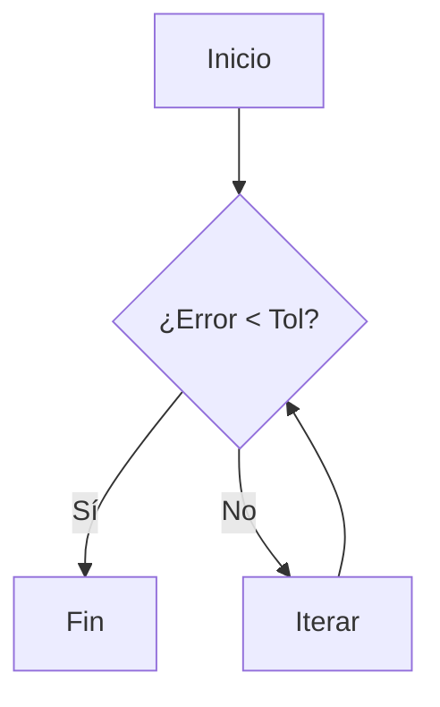

# {{title}}

## 🧠 Resumen / Punto Clave
[Explicación concisa del concepto o idea central. No tiene por qué ser una fórmula.]

## � Desarrollo / Explicación
[Sección flexible para texto, listas o tablas. Si hay matemáticas, usar LaTeX:]
$$
x_{n+1} = x_n - \frac{f(x_n)}{f'(x_n)}
$$

## 📊 Visualización / Algoritmo (Mermaid)
[Opcional: Usar para diagramas de flujo o lógica de programación]

## 💡 Ejemplos / Casos de uso
[Ejemplos prácticos, ejercicios o aplicaciones reales.]

## 🔗 Conexiones
- [MOC Matemáticas Numéricas](Matemáticas%20Numéricas.md)
- [Relacionado](path.md)
