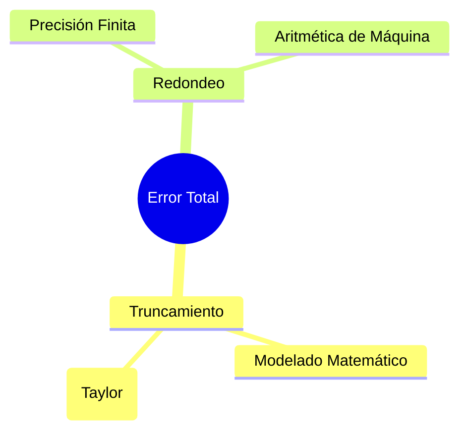

# Errores de Redondeo y Truncamiento

## 🧠 Resumen / Punto Clave
En computación numérica, el error total suele ser la suma del **error de truncamiento** (debido a la simplificación de métodos matemáticos) y el **error de redondeo** (debido a la precisión finita de la máquina).

## 📝 Desarrollo / Explicación

### 1. Error Absoluto y Relativo
Si $p^*$ es una aproximación de $p$:
- **Error Absoluto**: $E_{abs} = |p - p^*|$
- **Error Relativo**: $E_{rel} = \frac{|p - p^*|}{|p|}$ (donde $p \neq 0$)

### 2. Error de Truncamiento
Diferencia entre el valor exacto de una expresión matemática y su aproximación mediante un método numérico (ej. usar Taylor con pocos términos).

### 3. Error de Redondeo
Surge al representar números reales con un número finito de dígitos. Los sistemas actuales usan el estándar IEEE 754 (Punto Flotante).

## 📊 Jerarquía de Errores

## 💡 Caso Crítico: Cancelación de Dígitos Significativos
Ocurre al restar dos números muy cercanos entre sí, lo que amplifica enormemente el error relativo.

## 🔗 Conexiones
- [MOC Matemáticas Numéricas](../Matemáticas%20Numéricas.md)
- [Revisión de Cálculo](Revisión_Cálculo.md)
- [Aritmética de Máquina](Aritmética_Punto_Flotante.md)
