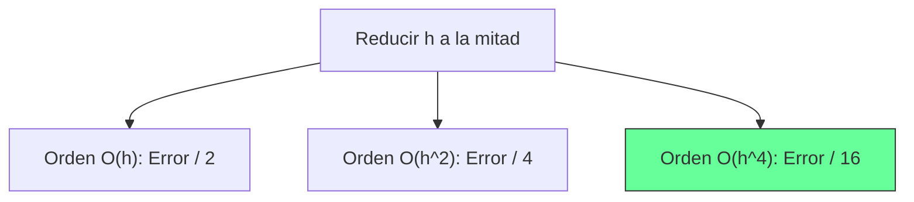

# Notación Big O y Velocidad de Convergencia

## 🧠 Resumen / Punto Clave
La notación Big O ($O$) se utiliza en Análisis Numérico para describir la **velocidad de convergencia** de un método o la magnitud del **error de truncamiento**. Nos indica cómo disminuye el error a medida que el tamaño de paso $h$ se hace más pequeño o el número de iteraciones $n$ aumenta.

## 📝 Desarrollo / Explicación

### 1. Definición para Funciones (Error de Truncamiento)
Decimos que $f(h) = O(g(h))$ cuando $h \to 0$ si existe una constante $C > 0$ tal que:
$$|f(h)| \leq C |g(h)|$$
para $h$ suficientemente pequeño.

> [!IMPORTANT]
> - Si un método es $O(h)$, al reducir $h$ a la mitad, el error se reduce a la mitad.
> - Si un método es $O(h^2)$, al reducir $h$ a la mitad, el error se reduce a **la cuarta parte**.

### 2. Definición para Sucesiones (Convergencia Iterativa)
Decimos que una sucesión $\{\alpha_n\}$ converge a $\alpha$ con velocidad de convergencia $O(\beta_n)$ si:
$$|\alpha_n - \alpha| \leq C |\beta_n|$$

### 3. Comparativa de Ordenes
- $O(h^4)$: Muy rápido (ej. Runge-Kutta 4, Simpson).
- $O(h^2)$: Rápido (ej. Diferencias centradas, Trapecio).
- $O(h)$: Lento (ej. Euler, Bisección).

## 📊 Impacto del Orden (Mermaid)

## 💡 Ejemplos / Casos de uso
- Se usa para decidir qué método es preferible: un método de orden superior permite usar un $h$ más grande (ahorrando cálculos) manteniendo la misma precisión.

## 🔗 Conexiones
- [MOC Matemáticas Numéricas](../Matemáticas%20Numéricas.md)
- [Errores de Redondeo y Truncamiento](Errores_Redondeo_Truncamiento.md)
- [Diferenciación Numérica](../04_Cálculo_Numérico/Diferenciación.md)
