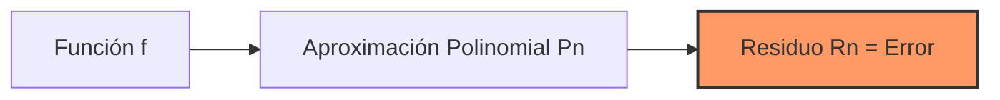

# Revisión de Cálculo

## 🧠 Resumen / Punto Clave
El análisis numérico se apoya en conceptos fundamentales del cálculo infinitesimal para garantizar la existencia, unicidad y convergencia de las soluciones aproximadas. Los teoremas de Taylor y del Valor Medio son las herramientas principales para acotar el error.

## 📝 Desarrollo / Explicación

### 1. Teorema del Valor Intermedio (Bolzano)
Si $f$ es continua en $[a, b]$ y $K$ es cualquier número entre $f(a)$ y $f(b)$, existe un número $c$ en $(a, b)$ tal que $f(c) = K$.
> [!IMPORTANT]
> Este teorema es la base del **Método de Bisección**.

### 2. Teorema de Taylor
Si $f \in C^n[a, b]$ y $f^{(n+1)}$ existe en $(a, b)$, entonces para cualquier $x, x_0 \in [a, b]$:
$$
f(x) = P_n(x) + R_n(x)
$$
Donde $P_n(x)$ es el polinomio de Taylor:
$$
P_n(x) = \sum_{k=0}^{n} \frac{f^{(k)}(x_0)}{k!}(x - x_0)^k
$$
Y $R_n(x)$ es el residuo (término de error):
$$
R_n(x) = \frac{f^{(n+1)}(\xi)}{(n+1)!}(x - x_0)^{n+1}
$$
para algún $\xi$ entre $x$ y $x_0$.

## 📊 Visualización (Concepto de Taylor)

## 💡 Ejemplo / Aplicación
Aproximación de $f(x) = \cos(x)$ alrededor de $x_0 = 0$:
- $n=2$: $P_2(x) = 1 - \frac{x^2}{2}$
- El error cometido al usar $P_2(x)$ en lugar de $\cos(x)$ viene dado por el término $R_2(x) = \frac{-\sin(\xi)}{6}x^3$.

## 🔗 Conexiones
- [MOC Matemáticas Numéricas](../Matemáticas%20Numéricas.md)
- [Errores de Redondeo y Truncamiento](Errores_Redondeo_Truncamiento.md)
