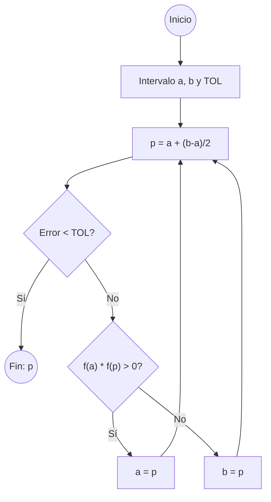

# Método de Bisección

## 🧠 Resumen / Punto Clave
El método de bisección es un algoritmo de búsqueda de raíces que divide repetidamente un intervalo a la mitad y selecciona el subintervalo en el que existe una raíz. Se basa en el **Teorema del Valor Intermedio** (Bolzano).

## 📝 Desarrollo / Explicación

### 1. Condiciones Iniciales
Dada una función continua $f$ en el intervalo $[a, b]$, debe cumplirse que:
$$f(a) \cdot f(b) < 0$$
Esto garantiza la existencia de al menos una raíz $p \in (a, b)$.

### 2. Algoritmo Paso a Paso
1. Definir $a_1 = a, b_1 = b$.
2. Para $n=1, 2, \dots$:
   - Calcular el punto medio: $p_n = a_n + \frac{b_n - a_n}{2}$.
   - Si $f(p_n) = 0$ o $\frac{b_n - a_n}{2} < TOL$, entonces $p = p_n$ (Fin).
   - Si $f(a_n) \cdot f(p_n) > 0$, entonces $a_{n+1} = p_n, b_{n+1} = b_n$.
   - Si no, $a_{n+1} = a_n, b_{n+1} = p_n$.

### 3. Cota de Error
El error absoluto en la etapa $n$ está acotado por:
$$|p - p_n| \leq \frac{b - a}{2^n}$$

## 📊 Algoritmo (Mermaid)

## 💡 Ejemplos / Casos de uso
- Útil cuando solo se conoce el intervalo y la función es continua.
- **Ventaja**: Siempre converge.
- **Desventaja**: Convergencia muy lenta (lineal).

## 🔗 Conexiones
- [MOC Matemáticas Numéricas](../Matemáticas%20Numéricas.md)
- [Revisión de Cálculo](../01_Preliminares_Error/Revisión_Cálculo.md)
- [Método de Newton-Raphson](Newton_Raphson.md)
- [Iteración de Punto Fijo](Punto_Fijo.md)
