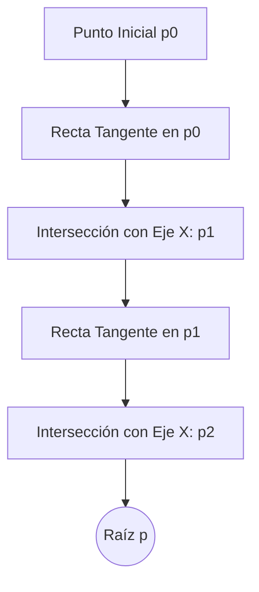

# Método de Newton-Raphson

## 🧠 Resumen / Punto Clave
El método de Newton-Raphson es una técnica iterativa de búsqueda de raíces que utiliza la derivada de la función para encontrar aproximaciones sucesivamente mejores. Es uno de los métodos más potentes debido a su **convergencia cuadrática** cuando se inicia cerca de la raíz.

## 📝 Desarrollo / Explicación

### 1. Derivación mediante Polinomio de Taylor
Si expandimos $f(x)$ alrededor de $p_n$ mediante un polinomio de Taylor de primer grado:
$$f(x) \approx f(p_n) + f'(p_n)(x - p_n)$$
Buscando el punto donde $f(x) = 0$:
$$0 = f(p_n) + f'(p_n)(p_{n+1} - p_n)$$
Despejando $p_{n+1}$:
$$p_{n+1} = p_n - \frac{f(p_n)}{f'(p_n)}$$

### 2. Algoritmo
1. Proporcionar una aproximación inicial $p_0$.
2. Para $n = 0, 1, 2, \dots$:
   - Calcular $p_{n+1} = p_n - \frac{f(p_n)}{f'(p_n)}$.
   - Detener si $|p_{n+1} - p_n| < TOL$ o $|f(p_{n+1})| < TOL$.

### 3. Convergencia
- **Orden de convergencia**: Cuadrático ($\alpha = 2$).
- **Requisito**: $f'(p) \neq 0$ en la raíz. Si $f'(p) = 0$, la raíz es múltiple y la convergencia se vuelve lineal.

## 📊 Visualización Geométrica

## 💡 Ejemplos / Casos de uso
- Muy eficiente para funciones suaves donde la derivada es fácil de calcular.
- **Limitación**: Requiere conocer $f'(x)$ y que el punto inicial sea suficientemente cercano a la raíz.

## 🔗 Conexiones
- [MOC Matemáticas Numéricas](../Matemáticas%20Numéricas.md)
- [Revisión de Cálculo (Taylor)](../01_Preliminares_Error/Revisión_Cálculo.md)
- [Método de la Secante](Secante_Posicion_Falsa.md)
- [Iteración de Punto Fijo](Punto_Fijo.md)
