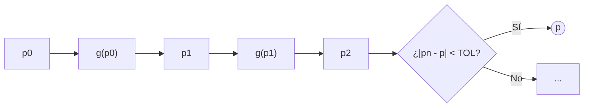

# Iteración de Punto Fijo

## 🧠 Resumen / Punto Clave
Un punto fijo de una función $g$ es un número $p$ tal que $g(p) = p$. El método de iteración de punto fijo busca encontrar este valor mediante la sucesión $p_{n+1} = g(p_n)$, transformando el problema de encontrar raíces $f(x)=0$ en uno de punto fijo $x = g(x)$.

## 📝 Desarrollo / Explicación

### 1. Teorema de Existencia y Unicidad (Explicación Simple)

Para que el método funcione, necesitamos asegurar dos cosas: que la solución **exista** y que sea **la única**.

- **Existencia**: Si la función $g(x)$ siempre devuelve valores que están dentro del mismo intervalo en el que empezamos ($[a, b]$), entonces cruzará la línea $y=x$ al menos una vez. Eso es nuestro punto fijo.
- **Unicidad**: Si además la pendiente de la función ($g'(x)$) es "suave" (menor que 1 en valor absoluto), entonces la función no puede "volver" a cruzar la línea $y=x$. Solo hay una solución.

> [!TIP]
> **En palabras simples:** Si intentas meter una hoja de papel arrugada dentro de una caja del mismo tamaño, al menos un punto del papel estará exactamente en la misma posición vertical que antes de arrugarlo. Si no lo arrugas demasiado fuerte (pendiente < 1), ese punto será único.

### 2. Algoritmo
1. Elegir una aproximación inicial $p_0$.
2. Generar la sucesión:
$$p_{n+1} = g(p_n) \text{ para } n = 0, 1, 2, \dots$$
3. El proceso converge si $|g'(p)| < 1$.

### 3. Cota de Error
El error cometido en la iteración $n$ se puede acotar por:
$$|p_n - p| \leq k^n \max\{p_0 - a, b - p_0\}$$
o también:
$$|p_n - p| \leq \frac{k^n}{1 - k} |p_1 - p_0|$$

## 📊 Visualización del Algoritmo

## 💡 Ejemplos / Casos de uso
- Se usa para resolver ecuaciones no lineales de la forma $x = g(x)$.
- **Velocidad de convergencia**: Generalmente lineal, dependiendo del valor de $|g'(p)|$.

## 🔗 Conexiones
- [MOC Matemáticas Numéricas](../Matemáticas%20Numéricas.md)
- [Método de Bisección](Bisección.md)
- [Método de Newton-Raphson](Newton_Raphson.md)
