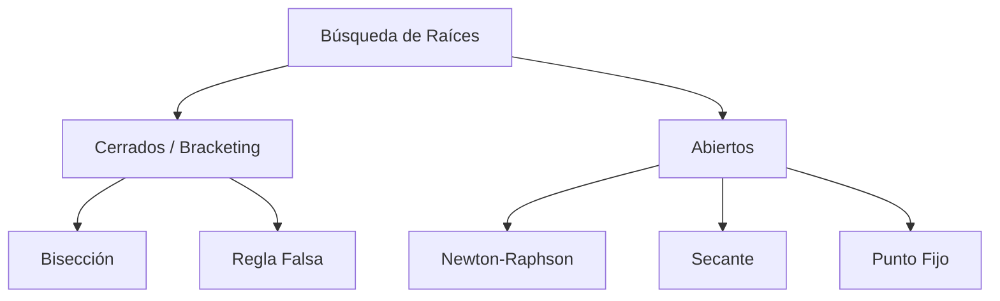

# Método de la Secante y Regla Falsa

## 🧠 Resumen / Punto Clave
Estos métodos son variantes del método de Newton que **no requieren el cálculo de la derivada**. En su lugar, aproximan la derivada mediante una secante que pasa por dos puntos previos.

## 📝 Desarrollo / Explicación

### 1. Método de la Secante
Aproxima $f'(p_{n-1})$ mediante la pendiente de la recta secante entre $(p_{n-2}, f(p_{n-2}))$ y $(p_{n-1}, f(p_{n-1}))$:
$$p_n = p_{n-1} - f(p_{n-1}) \frac{p_{n-1} - p_{n-2}}{f(p_{n-1}) - f(p_{n-2})}$$
- **Requisito**: Dos aproximaciones iniciales $p_0, p_1$.
- **Convergencia**: Superlineal ($\alpha \approx 1.618$), más rápida que bisección pero más lenta que Newton.

### 2. Método de la Regla Falsa (Regula Falsi)
Combina la lógica de la **Secante** con la de **Bisección**. Mantiene siempre la raíz encerrada entre dos puntos de signo opuesto.
- **Ventaja**: Garantiza convergencia (como bisección).
- **Desventaja**: Puede estancarse si un extremo no se mueve.

## 📊 Comparativa de Métodos (Mermaid)

## 💡 Ejemplos / Casos de uso
- Se prefiere la **Secante** cuando el cálculo de $f'(x)$ es computacionalmente costoso o imposible.
- Se usa **Regla Falsa** cuando se requiere seguridad de convergencia absoluta sin la lentitud excesiva de la bisección.

## 🔗 Conexiones
- [MOC Matemáticas Numéricas](../Matemáticas%20Numéricas.md)
- [Método de Newton-Raphson](Newton_Raphson.md)
- [Método de Bisección](Bisección.md)
