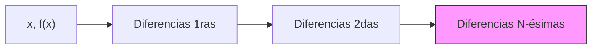

# Diferencias Divididas de Newton

## 🧠 Resumen / Punto Clave
El método de Diferencias Divididas de Newton es una forma eficiente de construir el polinomio interpolador. A diferencia de Lagrange, permite añadir nuevos puntos de interpolación sin tener que recalcular todo el polinomio, simplemente calculando una nueva fila en la tabla de diferencias.

## 📝 Desarrollo / Explicación

### 1. Definición de Diferencia Dividida
- **Cero-ésima**: $f[x_i] = f(x_i)$.
- **Primera**: $f[x_i, x_{i+1}] = \frac{f[x_{i+1}] - f[x_i]}{x_{i+1} - x_i}$.
- **K-ésima**: $f[x_i, x_{i+1}, \dots, x_{i+k}] = \frac{f[x_{i+1}, \dots, x_{i+k}] - f[x_i, \dots, x_{i+k-1}]}{x_{i+k} - x_i}$.

### 2. Forma de Newton del Polinomio
El polinomio de grado $n$ se expresa como:
$$P_n(x) = a_0 + a_1(x-x_0) + a_2(x-x_0)(x-x_1) + \dots + a_n(x-x_0)\dots(x-x_{n-1})$$
Donde los coeficientes son las diferencias divididas de la diagonal superior:
$$a_k = f[x_0, x_1, \dots, x_k]$$

## 📊 Construcción de la Tabla (Mermaid)

## 💡 Ejemplos / Casos de uso
- Se utiliza siempre que sea probable que el número de puntos de datos aumente.
- **Ventaja**: Cálculo incremental.
- **Relación**: Es matemáticamente equivalente al polinomio de Lagrange, solo cambia la forma de representación.

## 🔗 Conexiones
- [MOC Matemáticas Numéricas](../Matemáticas%20Numéricas.md)
- [Polinomios de Lagrange](Lagrange.md)
- [Interpolación de Hermite](Hermite.md)
