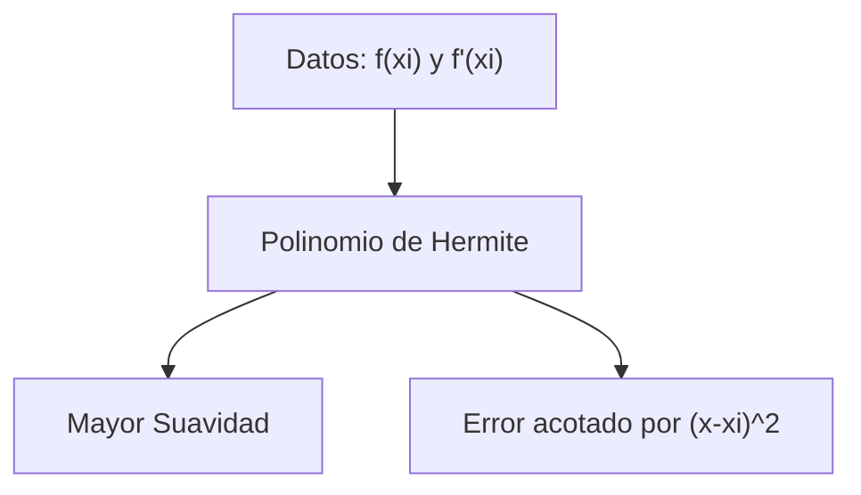

# Interpolación de Hermite

## 🧠 Resumen / Punto Clave
La interpolación de Hermite busca un polinomio que coincida no solo con los valores de la función en los nodos, sino también con sus **primeras derivadas**. Esto resulta en una aproximación mucho más suave y precisa que la interpolación polinomial simple.

## 📝 Desarrollo / Explicación

### 1. Condiciones del Polinomio
Dados $(n+1)$ puntos $x_0, \dots, x_n$, buscamos un polinomio $H(x)$ de grado a lo sumo $2n+1$ tal que:
- $H(x_i) = f(x_i)$ para $i=0, \dots, n$.
- $H'(x_i) = f'(x_i)$ para $i=0, \dots, n$.

### 2. Construcción mediante Diferencias Divididas
Se puede construir definiendo una nueva sucesión $z$:
$z_{2i} = z_{2i+1} = x_i$
Y utilizando diferencias divididas donde $f[z_{2i}, z_{2i+1}] = f'(x_i)$.

### 3. Error de Hermite
Si $f \in C^{2n+2}[a, b]$, para cada $x$ existe $\xi \in (a, b)$ tal que:
$$f(x) = H_{2n+1}(x) + \frac{f^{(2n+2)}(\xi)}{(2n+2)!} \prod_{i=0}^{n} (x - x_i)^2$$

## 📊 Propiedades de Hermite (Mermaid)

## 💡 Ejemplos / Casos de uso
- Se usa en aplicaciones de ingeniería donde se conoce la tasa de cambio (derivada) además de la magnitud.
- **Base de los Splines**: El concepto de Hermite es fundamental para entender los Splines Cúbicos.

## 🔗 Conexiones
- [MOC Matemáticas Numéricas](../Matemáticas%20Numéricas.md)
- [Diferencias Divididas de Newton](Diferencias_Divididas.md)
- [Splines Cúbicos](Splines.md)
