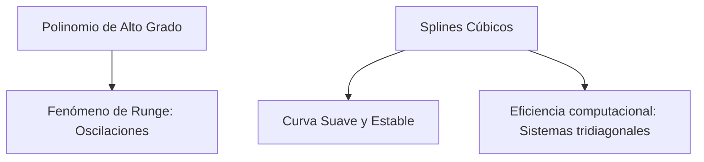

# Splines Cúbicos

## 🧠 Resumen / Punto Clave
Los Splines Cúbicos son una técnica de interpolación segmentaria que utiliza polinomios de tercer grado para unir pares de puntos adyacentes. A diferencia de la interpolación de alto grado, los splines evitan oscilaciones extremas (Fenómeno de Runge) y proporcionan una curva suave y continua en sus derivadas primera y segunda.

## 📝 Desarrollo / Explicación

### 1. Definición
Dado un conjunto de puntos $x_0 < x_1 < \dots < x_n$, un spline cúbico $S(x)$ es una función tal que en cada intervalo $[x_j, x_{j+1}]$ es un polinomio $S_j(x)$ de grado 3:
$$S_j(x) = a_j + b_j(x - x_j) + c_j(x - x_j)^2 + d_j(x - x_j)^3$$

### 2. Condiciones de Continuidad
Para que el spline sea suave, en los puntos internos $x_j$ ($j=1, \dots, n-1$) debe cumplirse:
- $S_j(x_{j+1}) = S_{j+1}(x_{j+1})$ (Continuidad de la función).
- $S'_j(x_{j+1}) = S'_{j+1}(x_{j+1})$ (Continuidad de la primera derivada).
- $S''_j(x_{j+1}) = S''_{j+1}(x_{j+1})$ (Continuidad de la segunda derivada).

### 3. Condiciones de Frontera
- **Natural**: $S''(x_0) = S''(x_n) = 0$.
- **Sujeta (Clamped)**: $S'(x_0) = f'(x_0)$ y $S'(x_n) = f'(x_n)$.

## 📊 Ventajas vs Otros Métodos (Mermaid)

## 💡 Ejemplos / Casos de uso
- Diseño gráfico (curvas de Bézier son similares).
- Trayectorias de robots.
- Suavizado de datos experimentales.

## 🔗 Conexiones
- [MOC Matemáticas Numéricas](../Matemáticas%20Numéricas.md)
- [Interpolación de Hermite](Hermite.md)
- [Aproximación por Mínimos Cuadrados](../03_Interpolación/Aproximación.md)
