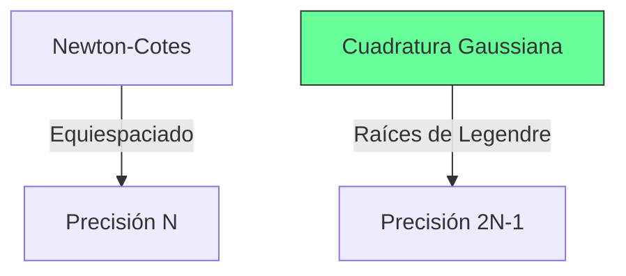

# Cuadratura Gaussiana

## 🧠 Resumen / Punto Clave
A diferencia de Newton-Cotes, que utiliza puntos equiespaciados, la Cuadratura Gaussiana elige los puntos (nodos) y los pesos de forma óptima para maximizar la precisión. Un método de $n$ puntos es exacto para polinomios de grado hasta $2n-1$.

## 📝 Desarrollo / Explicación

### 1. Concepto Fundamental
Buscamos aproximar la integral en $[-1, 1]$:
$$\int_{-1}^{1} f(x) dx \approx \sum_{i=1}^{n} c_i f(x_i)$$
Donde $x_i$ son las raíces del **Polinomio de Legendre** de grado $n$.

### 2. Cambio de Intervalo
Para integrar en $[a, b]$, se realiza una transformación lineal:
$$t = \frac{2x - a - b}{b - a} \implies x = \frac{1}{2}[(b-a)t + a + b]$$
$$\int_{a}^{b} f(x) dx = \int_{-1}^{1} f(\frac{(b-a)t + a + b}{2}) \frac{b-a}{2} dt$$

### 3. Ejemplo (n=2)
- **Nodos**: $x_1, x_2 = \pm \frac{1}{\sqrt{3}}$
- **Pesos**: $c_1, c_2 = 1$
$$ \int_{-1}^{1} f(x) dx \approx f(-\frac{1}{\sqrt{3}}) + f(\frac{1}{\sqrt{3}}) $$

## 📊 Eficiencia (Mermaid)

## 💡 Ejemplos / Casos de uso
- Se utiliza cuando la función es costosa de evaluar y se quiere el máximo rigor con el mínimo número de puntos.
- No es apta si solo disponemos de datos tabulados equiespaciados.

## 🔗 Conexiones
- [MOC Matemáticas Numéricas](../Matemáticas%20Numéricas.md)
- [Reglas de Newton-Cotes](Newton_Cotes.md)
- [Diferenciación Numérica](Diferenciación.md)
