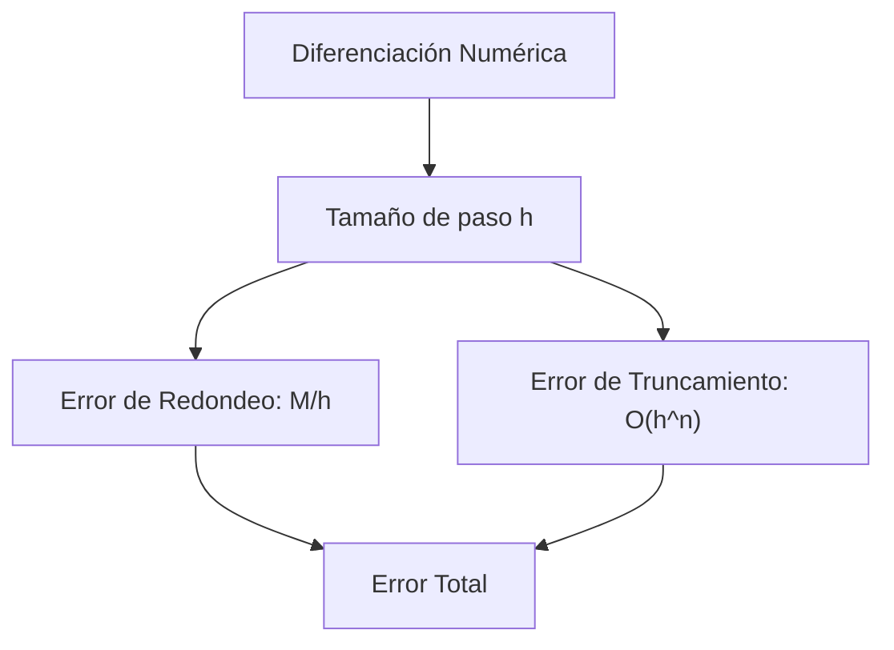

# Fórmulas de Diferenciación Numérica

## 🧠 Resumen / Punto Clave
La diferenciación numérica consiste en estimar la derivada de una función utilizando sus valores en un conjunto discreto de puntos. Estas fórmulas se derivan principalmente de los **Polinomios de Taylor**.

## 📝 Desarrollo / Explicación

### 1. Fórmulas de Diferencia Progresiva y Regresiva
Utilizan dos puntos y tienen error de orden [O(h)](../01_Preliminares_Error/Notación_Big_O.md).
- **Progresiva**: $f'(x_0) = \frac{f(x_0+h) - f(x_0)}{h} - \frac{h}{2}f''(\xi)$
- **Regresiva**: $f'(x_0) = \frac{f(x_0) - f(x_0-h)}{h} + \frac{h}{2}f''(\xi)$

### 2. Fórmula de Tres Puntos (Diferencia Centrada)
Es más precisa, con error de orden [O(h^2)](../01_Preliminares_Error/Notación_Big_O.md).
$$f'(x_0) = \frac{f(x_0+h) - f(x_0-h)}{2h} - \frac{h^2}{6}f'''(\xi)$$

### 3. Derivadas de Segundo Orden
$$f''(x_0) = \frac{f(x_0-h) - 2f(x_0) + f(x_0+h)}{h^2} - \frac{h^2}{12}f^{(4)}(\xi)$$

## 📊 Estructura de Error (Mermaid)

## 💡 Ejemplos / Casos de uso
- Fundamental en la resolución numérica de **Ecuaciones Diferenciales**.
- **Inestabilidad**: Cuando $h \to 0$, el error de redondeo aumenta, por lo que existe un $h$ óptimo que minimiza el error total.

## 🔗 Conexiones
- [MOC Matemáticas Numéricas](../Matemáticas%20Numéricas.md)
- [Revisión de Cálculo (Taylor)](../01_Preliminares_Error/Revisión_Cálculo.md)
- [Integración Numérica](Newton_Cotes.md)
