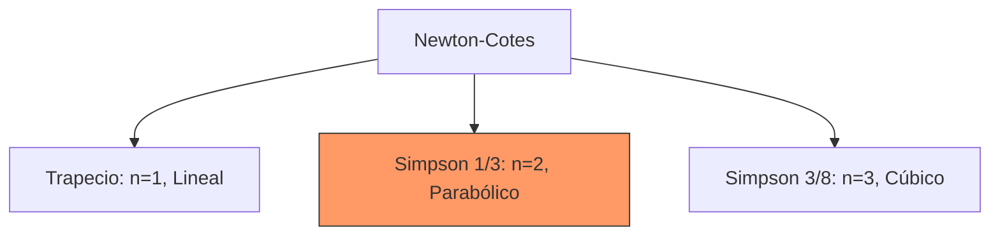

# Reglas de Newton-Cotes

## 🧠 Resumen / Punto Clave
Las fórmulas de Newton-Cotes son las técnicas más comunes de integración numérica. Se basan en aproximar la función $f(x)$ por un polinomio interpolador y luego integrar dicho polinomio.

## 📝 Desarrollo / Explicación

### 1. Regla del Trapecio ($n=1$)
Aproxima el área bajo la curva mediante un trapecio.
$$\int_{a}^{b} f(x) dx \approx \frac{h}{2} [f(x_0) + f(x_1)]$$
- **Error**: $-\frac{h^3}{12} f''(\xi)$.

### 2. Regla de Simpson 1/3 ($n=2$)
Aproxima la función mediante un polinomio de segundo grado (parábola). Requiere que el número de intervalos sea par.
$$\int_{a}^{b} f(x) dx \approx \frac{h}{3} [f(x_0) + 4f(x_1) + f(x_2)]$$
- **Error**: $-\frac{h^5}{90} f^{(4)}(\xi)$.

### 3. Regla de Simpson 3/8 ($n=3$)
Aproxima mediante un polinomio de tercer grado.
$$\int_{x_0}^{x_3} f(x) dx \approx \frac{3h}{8} [f(x_0) + 3f(x_1) + 3f(x_2) + f(x_3)]$$
- **Error**: $-\frac{3h^5}{80} f^{(4)}(\xi)$.

## 📊 Relación de Métodos (Mermaid)

## 💡 Ejemplos / Casos de uso
- Se utilizan cuando los datos están tabulados en intervalos equiespaciados.
- **Grado de Precisión**: La Regla de Simpson es sorprendentemente precisa (exacta para polinomios de grado 3) a pesar de usar solo 3 puntos.

## 🔗 Conexiones
- [MOC Matemáticas Numéricas](../Matemáticas%20Numéricas.md)
- [Integración Compuesta](Integración_Compuesta.md)
- [Cuadratura Gaussiana](Cuadratura_Gaussiana.md)
