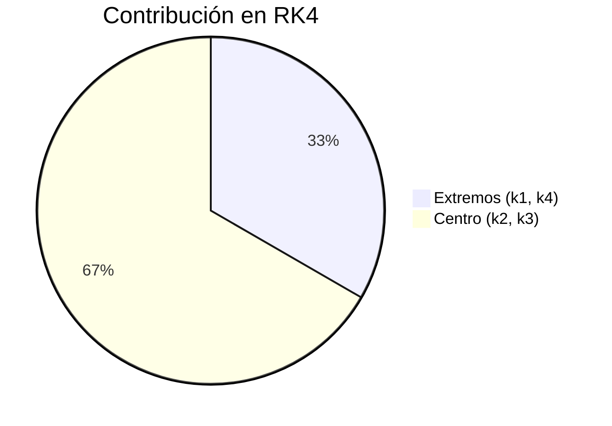

# Métodos de Runge-Kutta

## 🧠 Resumen / Punto Clave
Los métodos de Runge-Kutta (RK) son una familia de algoritmos iterativos para resolver EDOs que logran la alta precisión de los métodos de Taylor sin necesidad de calcular derivadas de orden superior. Lo consiguen evaluando la función $f(t, y)$ en varios puntos intermedios dentro de cada paso.

## 📝 Desarrollo / Explicación

### 1. Runge-Kutta de Orden 2 (Punto Medio)
$$w_{i+1} = w_i + h f(t_i + \frac{h}{2}, w_i + \frac{h}{2} f(t_i, w_i))$$

### 2. Runge-Kutta de Cuarto Orden (RK4)
Es el estándar de la industria debido a su excelente equilibrio entre costo computacional y precisión.
$$w_{i+1} = w_i + \frac{1}{6}(k_1 + 2k_2 + 2k_3 + k_4)$$
Donde las pendientes intermedias son:
- $k_1 = h f(t_i, w_i)$
- $k_2 = h f(t_i + \frac{h}{2}, w_i + \frac{k_1}{2})$
- $k_3 = h f(t_i + \frac{h}{2}, w_i + \frac{k_2}{2})$
- $k_4 = h f(t_{i+1}, w_i + k_3)$

### 3. Error
El método RK4 tiene un error de truncamiento local de $O(h^5)$ y un error global de $O(h^4)$.

## 📊 Pesos de las Pendientes (Mermaid)

## 💡 Ejemplos / Casos de uso
- RK4 es el método "por defecto" para la mayoría de problemas de física e ingeniería que involucran EDOs.
- **Sistemas de EDOs**: Todos estos métodos se pueden extender fácilmente a sistemas de ecuaciones vectoriales.

## 🔗 Conexiones
- [MOC Matemáticas Numéricas](../Matemáticas%20Numéricas.md)
- [Método de Euler](Euler.md)
- [Métodos de Taylor](Taylor.md)
