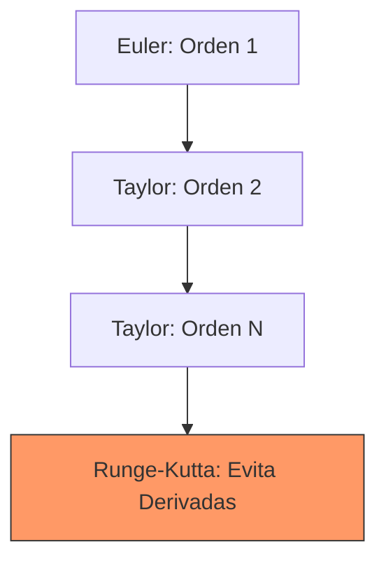

# Métodos de Taylor (Orden Superior)

## 🧠 Resumen / Punto Clave
Los métodos de Taylor de orden superior generalizan el método de Euler utilizando más términos de la serie de Taylor. Esto permite reducir el error de truncamiento a cambio de tener que calcular derivadas de orden superior de la función $f(t, y)$.

## 📝 Desarrollo / Explicación

### 1. Algoritmo de Orden $n$
$$w_{i+1} = w_i + h T^{(n)}(t_i, w_i)$$
Donde:
$$T^{(n)}(t, w) = f(t, w) + \frac{h}{2} f'(t, w) + \dots + \frac{h^{n-1}}{n!} f^{(n-1)}(t, w)$$

### 2. Error
Un método de Taylor de orden $n$ tiene un error de truncamiento local de [O(h^{n+1})](../01_Preliminares_Error/Notación_Big_O.md) y un error global de [O(h^n)](../01_Preliminares_Error/Notación_Big_O.md).

### 3. El Desafío de las Derivadas
Para usar un método de Taylor de orden 4, por ejemplo, necesitamos $f', f'', f'''$. Esto requiere usar la regla de la cadena para derivadas totales:
$$f'(t, y) = \frac{\partial f}{\partial t} + \frac{\partial f}{\partial y} f(t, y)$$

## 📊 Comparativa de Orden (Mermaid)

## 💡 Ejemplos / Casos de uso
- Se usan cuando se dispone de una forma analítica sencilla para las derivadas de $f$.
- **Transición**: Debido a la complejidad de calcular derivadas, en la práctica se prefieren los **Métodos de Runge-Kutta**.

## 🔗 Conexiones
- [MOC Matemáticas Numéricas](../Matemáticas%20Numéricas.md)
- [Método de Euler](Euler.md)
- [Métodos de Runge-Kutta](Runge_Kutta.md)
