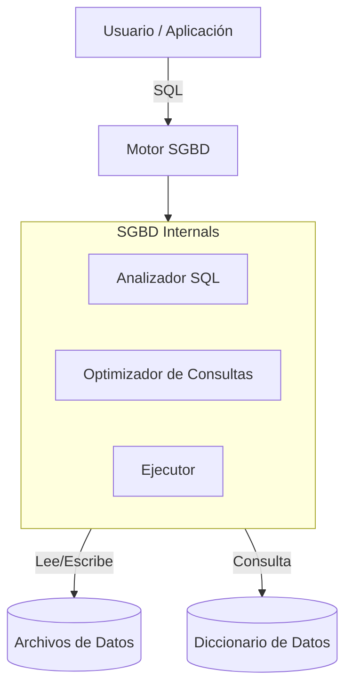

# Arquitectura SGBD

La arquitectura de un [SGBD Definicion](SGBD_Definicion.md) define cómo procesa las consultas y gestiona los datos.

## Componentes Clave
*   **Parser**: Verifica la sintaxis de la consulta.
*   **Optimizador**: Decide la mejor estrategia de ejecución (índices, orden de joins).
*   **Ejecutor**: Realiza las operaciones físicas sobre los datos.
*   **Diccionario de Datos**: Metadatos sobre la estructura de la BD (tablas, columnas, usuarios).

---
[00 MOC Introduccion](00_MOC_Introduccion.md)
