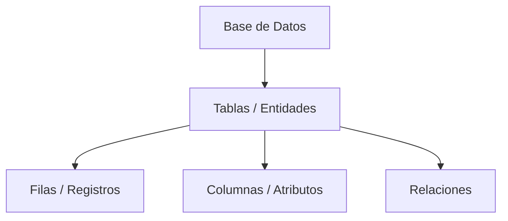

# Definición de Base de Datos

Una **Base de Datos (BD)** es un conjunto **organizado de datos** que permite guardar, gestionar y recuperar información de manera eficiente.

A diferencia de un sistema de archivos tradicional, una BD impone **estructuras y reglas** que garantizan la integridad y consistencia de los datos.

## Estructura Básica
En el modelo más común ([Modelo Relacional Conceptos](../02_Dise%C3%B1o/Modelo_Relacional_Conceptos.md)), la estructura se jerarquiza así:

## Relacionado
*   Gestionado por: [SGBD Definicion](SGBD_Definicion.md)
*   Tipos: [Tipos de Bases de Datos](Tipos_de_Bases_de_Datos.md)
*   Historia: [Historia Bases de Datos](Historia_Bases_de_Datos.md)

---
[00 MOC Introduccion](00_MOC_Introduccion.md)
