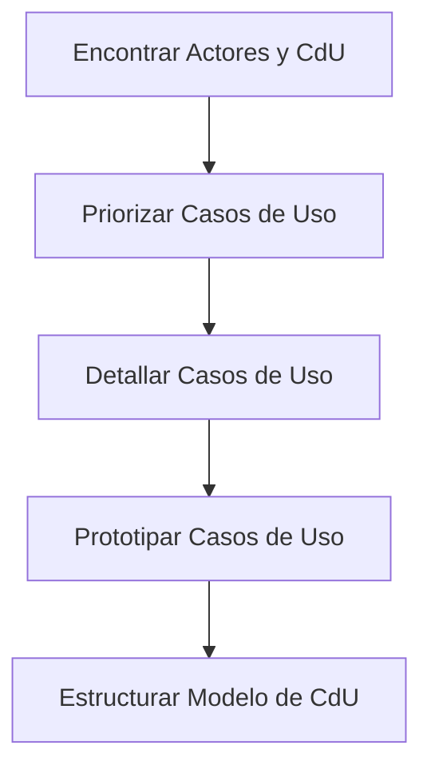

# Casos de Uso (CdU)

Los **Casos de Uso** son el artefacto primordial en RUP para establecer, comunicar y validar el comportamiento deseado del sistema. Son la brújula que guía al equipo desde los requisitos más abstractos hasta las pruebas de aceptación final.

---

## ¿Por qué los Casos de Uso son el corazón de la captura de valor?

En un proyecto de software, es fácil perderse en detalles técnicos y olvidar para qué se está construyendo la herramienta. Los CdU mantienen el foco en el usuario y en los resultados tangibles.

### ¿Cómo definimos la interacción entre el mundo exterior y nuestro sistema?

Un Caso de Uso es una descripción de cómo un **Actor** interactúa con el sistema para lograr un objetivo específico. No es solo una lista de funciones o botones; es una narrativa que describe una secuencia de eventos y respuestas que entregan un valor real.

### ¿De qué manera articulan el desarrollo de principio a fin?

Los CdU no son solo documentos de texto; son el motor que impulsa todas las disciplinas:

- **Identifican requisitos funcionales**: Dicen —exactamente— qué debe hacer el sistema desde la perspectiva de quien lo usa.
- **Lenguaje común**: Actúan como puente entre los interesados (clientes) y los desarrolladores, evitando malentendidos costosos.
- **Base para todo**: Son la entrada principal para el análisis, el diseño, la implementación y —especialmente— para la creación de planes de prueba.

**La regla de oro:** ==Un caso de uso debe entregar un resultado observable de valor para el actor.==

---

## ¿Cómo evoluciona un Caso de Uso desde la idea hasta la validación?

Para construir un modelo de casos de uso sólido, seguimos un ciclo de vida que refina la idea inicial hasta convertirla en una guía de construcción precisa.

1. [[Encontrar Actores y CdU]]
2. [[Priorizar Casos de Uso]]
3. [[Detallar Casos de Uso]]
4. [[Prototipar Casos de Uso]]
5. [[Estructurar Modelo de CdU]]

### ¿Qué hitos marcan el camino hacia un modelo de CdU robusto?

1.  **Identificación**: Determinamos quién usa el sistema y para qué objetivo concreto.
2.  **Estrategia**: Decidimos qué es lo más importante o lo que conlleva más riesgo técnico (Priorización).
3.  **Especificación**: Describimos la interacción paso a paso —incluyendo los flujos principal y alternativos—.
4.  **Validación**: Comprobamos cómo se verá la interfaz mediante prototipos para confirmar el entendimiento.
5.  **Optimización**: Buscamos partes comunes o variaciones que podamos reutilizar —Inclusión, Extensión y Generalización—.

---

## Referencias

1. [[Ingeniería de Software]]
2. [[Rational Unified Process]]
3. [[Disciplina de Requisitos]]
4. **Mmasias**. _idsw1: Temario de la asignatura de Ingeniería de Software_. [GitHub](https://github.com/mmasias/idsw1) / [[500 Biblioteca/idsw1/README.md|Copia Local]].
