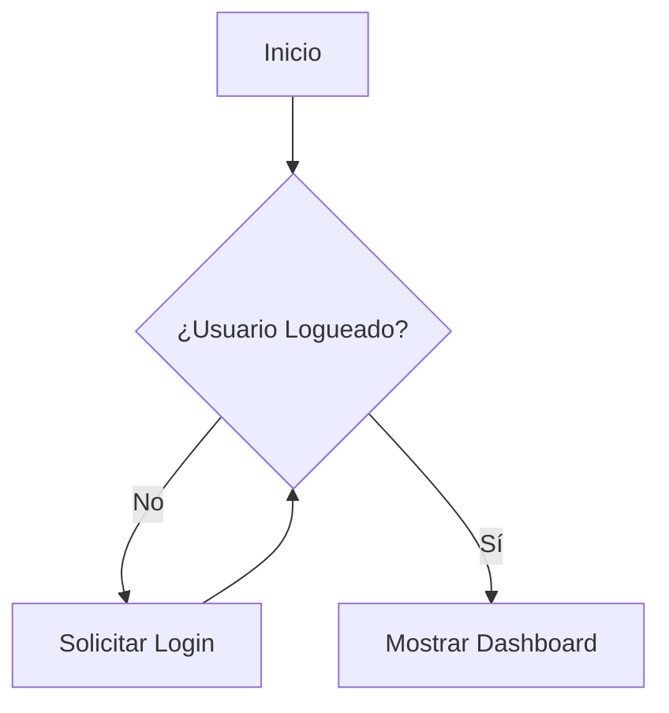

# Detallar Casos de Uso

Detallar un caso de uso significa especificar la secuencia exacta de pasos que el actor y el sistema realizarán para cumplir un objetivo. Es el "guion" técnico de la interacción que elimina cualquier rastro de ambigüedad.

---

## ¿Cómo transformamos una idea general en un guion de ejecución preciso?
Un nombre como "Realizar Compra" es insuficiente para programar. Necesitamos desglosar la danza de mensajes entre el usuario y la máquina.

### ¿Qué caminos puede tomar la interacción entre el hombre y la máquina?
No solo debemos documentar el éxito; debemos estar preparados para la realidad del error:
- **Flujo Principal (Happy Path)**: El camino ideal donde el usuario introduce los datos correctos y el sistema responde según lo previsto.
- **Flujos Alternativos**: Variaciones válidas del proceso (ej. el usuario decide cambiar el método de pago a mitad de la operación).
- **Excepciones**: Qué ocurre cuando algo falla —como una tarjeta rechazada o una pérdida de conexión—.

### ¿Qué componentes estructurales garantizan una descripción completa?
Una especificación profesional debe contener, al menos, estos cinco elementos:
1.  **Precondiciones**: Estado necesario del sistema antes de iniciar (ej. "El usuario debe estar autenticado").
2.  **Escenario**: El contexto o "disparador" que da inicio a la acción.
3.  **Flujo de Eventos**: El diálogo narrado paso a paso entre el Actor y el Sistema.
4.  **Postcondiciones**: El estado final tras el éxito (ej. "Stock actualizado y factura emitida").
5.  **Requisitos Especiales**: Restricciones técnicas o de rendimiento (ej. "El proceso no debe tardar más de 2 segundos").

---

## ¿Cómo redactamos especificaciones que eviten la ambigüedad técnica?
La claridad en la redacción es lo que separa un buen requisito de un bug futuro.

### ¿Qué reglas sintácticas debemos seguir para una comunicación clara?
Para mantener la consistencia, dividimos las responsabilidades de forma estricta en el texto:

| El Actor ÚNICAMENTE... | El Sistema ÚNICAMENTE... |
| :--- | :--- |
| Introduce datos en los campos | Permite la introducción de datos |
| Solicita / Pide una acción | Presenta / Muestra / Visualiza un resultado |

### ¿Qué errores comunes debemos evitar al describir el comportamiento?
¡OJO! No caigas en estas "contraindicaciones" del modelado:
- **No intenciones**: Evita frases como "el jugador decide..." o "el cliente quiere...". No podemos programar deseos, solo acciones.
- **No implementación**: Evita menciones a la base de datos o estructuras de código. Eso pertenece al diseño, no a los requisitos.
- **No interfaz prematura**: Evita "hacer clic en el botón azul" o "deslizar a la derecha". La UI se define en la fase de prototipado.

### ¿Qué recursos visuales complementan la narrativa textual?
A veces, una imagen ayuda a desenredar flujos complejos que el texto no alcanza a explicar con fluidez:
- **Diagramas de Actividad**: Ideales para visualizar decisiones lógicas o procesos que ocurren en paralelo.
- **Diagramas de Estado**: Útiles cuando el comportamiento del sistema depende estrictamente del estado previo de un objeto.

---

## Referencias
1. **Mmasias**. *idsw1: Temario de la asignatura de Ingeniería de Software*. [GitHub](https://github.com/mmasias/idsw1) / [[500 Biblioteca/idsw1/README.md|Copia Local]].
