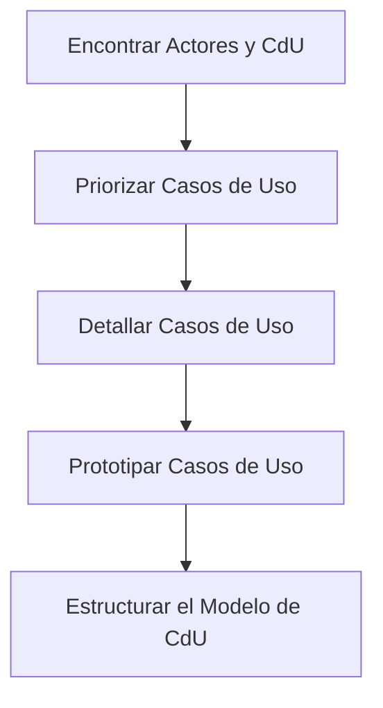

# Disciplina de Requisitos

La **Disciplina de Requisitos** es el flujo de trabajo encargado de asegurar que construimos el **sistema correcto**. Su objetivo principal es alcanzar un acuerdo sólido entre clientes, usuarios y desarrolladores sobre lo que el sistema debe hacer.

---

## ¿Por qué es crucial establecer un acuerdo sobre qué construir?
Sin una disciplina de requisitos clara, nos enfrentamos a preguntas críticas sin respuesta que pueden llevar al fracaso del proyecto:
- ¿En qué orden preguntamos al cliente?
- ¿Cómo justificamos el tiempo y el personal asignado?
- ¿Cómo sabemos si el cliente estará satisfecho antes de terminar?

### ¿A qué riesgos nos exponemos sin una captura formal?
La falta de rigor en esta fase suele derivar en la construcción de funcionalidades que nadie utiliza o —peor aún— en la omisión de procesos críticos para el negocio. La **[[Disciplina de Requisitos]]** actúa como un contrato vivo que evoluciona con el proyecto.

### ¿Cómo beneficia este flujo a los distintos perfiles?
Tiene un doble propósito dependiendo de a quién afecte:

- **Para el equipo técnico**: Define los límites del sistema y da a los desarrolladores una comprensión profunda de las necesidades. Es la base ineludible para el análisis, el diseño y la implementación.
- **Para gestión (DevOps/PM)**: Provee la base para planificar cada iteración y estimar costes y tiempos de forma realista.

#### Racionalización por Stakeholder (Interrogatorio Analítico)
La captura de requisitos sirve a tres propósitos distintos:
- **Cliente:** Define el orden de preguntas y valida si la solución resuelve el problema de negocio.
- **Jefe de Proyecto:** Justifica la producción de código y la asignación de recursos y personal.
- **Equipo Directivo:** Emplea los requisitos para evaluar el grado de satisfacción mensual y justificar la inversión económica.

**La regla de oro:** Si no hay acuerdo en los requisitos, no hay éxito en el proyecto.

---

## ¿Cuál es la ruta para transformar necesidades en realidades?
Para pasar de una idea difusa a una especificación técnica, seguimos un camino estructurado que valida cada paso con los interesados.

### ¿De qué actividades se compone el flujo de trabajo?
El flujo de trabajo se descompone en las siguientes actividades —secuenciales y a la vez cíclicas— que garantizan la cobertura total del sistema:

1.  **[[Encontrar Actores y CdU]]**: Identificamos quién usa el sistema y para qué.
2.  **[[Priorizar Casos de Uso]]**: Decidimos qué es crítico para la arquitectura y el negocio.
3.  **[[Detallar Casos de Uso]]**: Describimos paso a paso el flujo de eventos.
4.  **[[Prototipar Casos de Uso]]**: Validamos la interfaz con el usuario mediante prototipos (UI/UX).
5.  **[[Estructurar Modelo de CdU]]**: Refinamos el modelo para evitar redundancias y mejorar la claridad.

> [!TIP] Enfoque en el Cliente
> No te limites a tomar nota de lo que el cliente dice. Tu labor es guiarlo para descubrir lo que realmente necesita para solucionar sus problemas de negocio.

---

## Referencias
1. [[Ingeniería de Software]]
2. [[Rational Unified Process]]
3. **Mmasias**. *idsw1: Temario de la asignatura de Ingeniería de Software*. [GitHub](https://github.com/mmasias/idsw1) / [[500 Biblioteca/idsw1/README.md|Copia Local]].
