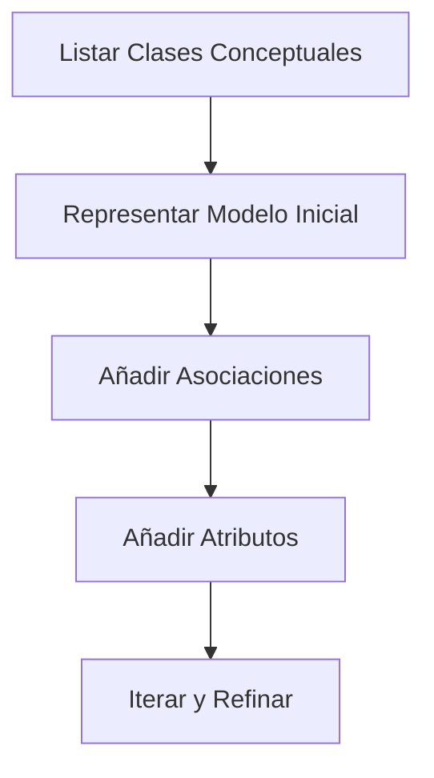
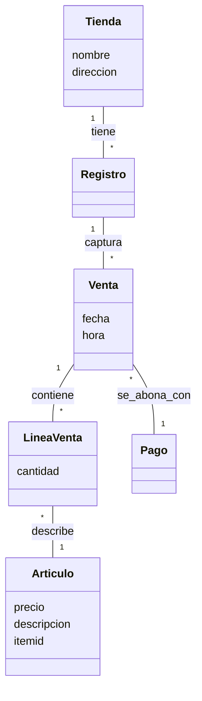

# Modelo del Dominio (MdD)

El **Modelo del Dominio** es la representación de las clases conceptuales más importantes del mundo real en el contexto de nuestra solución. Es el mapa que nos permite entender la realidad antes de intentar codificarla.

---

## ¿Por qué necesitamos entender la realidad antes que el código?
Las soluciones de software no existen en el vacío; se aplican sobre una realidad con procesos y reglas propias. Intentar programar sin entender estas reglas es una receta para el desastre técnico.

### ¿Qué beneficios aporta crear un mapa conceptual del negocio?
El MdD actúa como un puente entre dos mundos que a menudo hablan idiomas distintos:
- Genera un **vocabulario común** entre desarrolladores, clientes y expertos del dominio.
- Permite comprender la estructura y dinámica de la organización sin el ruido de la tecnología.
- Identifica los requisitos de información fundamentales —lo que el sistema debe recordar— antes de considerar cualquier restricción informática.

### ¿Cómo evitar confundir el negocio con la implementación?
¡OJO! Es vital no contaminar el dominio con conceptos técnicos. El MdD debe ser puro:
- **No es un diseño de Base de Datos**: No pienses en tablas ni claves foráneas.
- **No son clases de software**: No pienses en métodos, tipos de datos específicos (ej. `ArrayList`) o patrones de diseño.
- **Es independiente del entorno**: No importa si vas a usar SQL, NoSQL o Grafos; el dominio permanece inalterado.

**La regla de oro:** Modelas para entender el negocio, no para diseñar el código.

---

## ¿Cómo se construye un modelo de dominio efectivo?
El proceso de construcción es iterativo y se basa en la extracción de conceptos a partir de la narrativa del negocio.

### ¿Qué metodología seguimos para destilar la esencia del dominio?

1.  **Hallar Clases Conceptuales**: Identifica ideas, cosas u objetos —Sustantivos—. 
    - *Técnica:* Analiza descripciones textuales y busca objetos físicos, transacciones (ej. Venta), roles (ej. Cliente) o lugares.
2.  **Identificar Asociaciones**: Conexiones con significado entre objetos. 
    - *Tip:* Usa el sentido común. Ni tantas que saturen el diagrama, ni tan pocas que se pierda información vital.
3.  **Identificar Atributos**: Propiedades relevantes que deben recordarse (ej. nombre, fecha, precio). 
    - *¡OJO!* Si tienes dudas de si algo es un atributo o una clase, inclínalo hacia **clase conceptual**.

### ¿Cómo se visualizan estas relaciones en la práctica?

### ¿Qué errores suelen descarrilar el modelado?
- **Confundir con BD**: Crear una clase "VentaID" en lugar de relacionar directamente "Venta" con sus líneas.
- **Sobre-modelar**: Intentar capturar cada detalle minúsculo antes de entender los procesos básicos —la parálisis por análisis—.
- **Falta de Validación**: No contrastar el modelo con los expertos. Si el cliente no entiende tu MdD, tu modelo no refleja la realidad.

---

## Referencias
1. [[Ingeniería de Software]]
2. [[Disciplina de Requisitos]]
3. **Mmasias**. *idsw1: Temario de la asignatura de Ingeniería de Software*. [GitHub](https://github.com/mmasias/idsw1) / [[500 Biblioteca/idsw1/README.md|Copia Local]].
