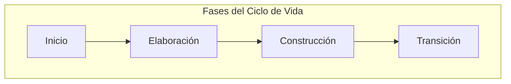

# RUP (Rational Unified Process)

El **Rational Unified Process** (RUP) es un framework de trabajo diseñado para gestionar el desarrollo de software de forma disciplinada, minimizando riesgos y maximizando la eficiencia en entornos de cambio constante.

---

## ¿Cómo surge RUP como respuesta a la crisis del software?

En el desarrollo de software, la complejidad y el cambio son los mayores enemigos. RUP propone un enfoque estructurado pero adaptable para convertir los requisitos del cliente en un producto de alta calidad.

**La regla de oro:** Modelamos para gestionar la complejidad, no solo para documentar.

### ¿Sobre qué cimientos se construye un proceso disciplinado?

El sistema se sostiene sobre cuatro pilares que garantizan la estabilidad del proyecto:

- **Basado en Componentes**: El software se construye mediante piezas pequeñas, manejables y reutilizables interconectadas por interfaces.
- **Dirigido por [[Casos de Uso]]**: Las funcionalidades deseadas guían todo el proceso —desde el análisis hasta las pruebas—.
- **Centrado en la Arquitectura**: La estructura del sistema es el artefacto primordial para su evolución.
- **Iterativo e Incremental**: El desarrollo no es lineal; se basa en ciclos (iteraciones) que entregan un producto ejecutable y mejorado en cada paso.

### ¿Cómo se distribuye el esfuerzo a lo largo del tiempo?

A diferencia del modelo en cascada —donde cada fase debe terminar antes de empezar la siguiente—, RUP divide el proyecto en cuatro fases que se solapan con las disciplinas técnicas:

1.  **Inicio (Inception)**: La idea inicial se lleva hasta el punto de estar suficientemente fundada.
    - Se delimita el ámbito del sistema propuesto.
    - Se demuestra a los usuarios/clientes que el sistema es viable (a menudo construyendo un prototipo como prueba de concepto).
    - Se esboza la arquitectura candidata.
    - Se identifican los riesgos críticos.
2.  **Elaboración (Elaboration)**: Se define la arquitectura base del sistema.
    - Se identifican y mitigan los riesgos significativos (aquellos que podrían alterar planes, costos y horarios).
    - Se crea una línea de base arquitectónica que cubre la funcionalidad esencial.
    - Se capturan aproximadamente el 80% de los requisitos funcionales (Casos de Uso).
    - Se prepara una estimación de tiempos y costos más realista.
3.  **Construcción (Construction)**: El software se lleva a su completitud operativa.
    - Se extiende la identificación y descripción a *todos* los casos de uso restantes.
    - Se completan las disciplinas de análisis, diseño, implementación y pruebas.
    - Se mantiene la integridad de la arquitectura, modificándola solo si es estrictamente necesario.
    - Se monitorizan los riesgos heredados de fases anteriores.
4.  **Transición (Transition)**: El producto final se pone en manos de la comunidad de usuarios.
    - Se realizan actividades de preparación (ej. sitio web, infraestructura).
    - Se elaboran manuales y documentación de entrega.
    - Se ajusta el software bajo los parámetros reales del entorno del usuario (Beta testing).
    - Se corrigen los defectos encontrados tras la retroalimentación de los usuarios.

---

## ¿Cómo se traduce el proceso en actividades diarias?

Para implementar RUP de forma efectiva, debemos entender sus componentes operativos y cómo interactúan entre sí.

### ¿Qué piezas componen el motor del desarrollo?

- **Actividad**: Unidad de trabajo realizada por un **Rol** (ej. "Analizar Caso de Uso").
- **Artefacto**: Productos tangibles —documentos, código o modelos— producidos o modificados durante el proceso.
- **Rol**: Define el comportamiento y responsabilidades de una persona o equipo.
- **Disciplina**: Organiza las actividades de forma temática (ej. Disciplina de Requisitos, Disciplina de Diseño).

#### Matriz de Responsabilidades (Roles Clave)
- **Analista de sistemas:** Lidera la **[[Disciplina de Requisitos]]**.
- **Especificador de CdU / Diseñador de Interfaces:** Participan en la definición funcional.
- **Arquitecto:** Único rol con presencia crítica en Requisitos, Análisis, Diseño e Implementación.
- **Ingeniero de Componentes:** Presente en Diseño, Análisis, Implementación y Pruebas.

#### Perfil Cuantitativo de las Fases (Esfuerzo vs Tiempo)
| Fase | Duración (%) | Esfuerzo (%) | Objetivo Crítico |
| :--- | :---: | :---: | :--- |
| **Inicio** | 10 | 5 | Viabilidad y Riesgos |
| **Elaboración** | 30 | 20 | Línea Base Arquitectónica |
| **Construcción** | 50 | 65 | Completitud Operativa |
| **Transición** | 10 | 10 | Entrega y Ajuste Final |

### ¿De qué manera organizamos las distintas áreas de trabajo?

| Técnicas                     | De Soporte              |
| :--------------------------- | :---------------------- |
| [[Modelo del Dominio]]       | Gestión de Proyecto     |
| [[Disciplina de Requisitos]] | Entorno                 |
| Análisis                     | Configuración y Cambios |
| Diseño                       | Despliegue              |
| Implementación               |                         |
| Pruebas                      |                         |

> [!IMPORTANT] Iterativo ≠ Prototipado
> La salida de una iteración no es un prototipo desechable, sino un subconjunto con **calidad de producción** del sistema final. El objetivo es obtener retroalimentación temprana —el famoso "Sí... pero"— para ajustar el rumbo antes de que sea tarde.

### ¿Cómo saber si estamos cayendo en viejos vicios?

¡OJO! No estás haciendo RUP si:

- Piensas que Inicio = Requisitos y Elaboración = Diseño (eso es cascada).
- Intentas definir todos los requisitos antes de programar nada.
- Tus iteraciones duran 4 meses en lugar de las 2-4 semanas recomendadas.
- Crees que programar es solo una "traducción mecánica" de los diagramas UML.

---

## Referencias

1. [[Ingeniería de Software]]
2. **Mmasias**. _idsw1: Temario de la asignatura de Ingeniería de Software_. [GitHub](https://github.com/mmasias/idsw1) / [[500 Biblioteca/idsw1/README.md|Copia Local]].
