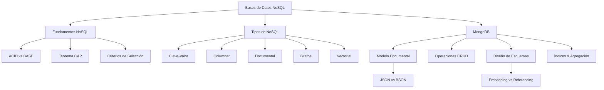

# Implementation Plan: Bases de Datos 2 Knowledge Base

The goal of this project is to transform raw class notes from `500 Biblioteca/Bases-De-Datos-2` into a high-quality, atomic, and interconnected Zettelkasten knowledge base in `200 Proyectos/Bases-De-Datos-2-Zettelkasten`.

### Conceptual Tree

## Proposed Changes

### Knowledge Architecture

1.  **Structure Definition**: Based on the project overview, the content will be organized into:
    *   NoSQL Foundations
    *   NoSQL Types (Key-Value, Document, Columnar, Graph)
    *   MongoDB (CRUD, Indexes, Schema Design, Aggregation, Advanced Modeling)
2.  **Atomicity Scale**: Each note will capture exactly one theoretical concept or why/how. Cross-cutting scrollings will be avoided (< 2).
3.  **Exercise Handling**: Extended exercises will be separated into `Ejercicio - [Tema]` format.

### [NEW] Zettelkasten Folder (c:\Users\symid\Documents\Apuntes\200 Proyectos\Bases-De-Datos-2-Zettelkasten)

Summary of the core knowledge areas to be implemented.

#### [NEW] [NoSQL-Introduction.md](file:///c:/Users/symid/Documents/Apuntes/200%20Proyectos/Bases-De-Datos-2-Zettelkasten/NoSQL-Introduction.md)
Introduction to NoSQL concepts, CAP theorem, and consistency models.

#### [NEW] [MongoDB-CRUD.md](file:///c:/Users/symid/Documents/Apuntes/200%20Proyectos/Bases-De-Datos-2-Zettelkasten/MongoDB-CRUD.md)
Document-based operations, query logic, and syntax.

#### [NEW] [MongoDB-Schema-Design.md](file:///c:/Users/symid/Documents/Apuntes/200%20Proyectos/Bases-De-Datos-2-Zettelkasten/MongoDB-Schema-Design.md)
Embedding vs. Referencing, denormalization, and use cases.

## Verification Plan

### Manual Verification
*   Check all LaTeX formulas for correct syntax and rendering.
*   Validate all wikilinks (`[[Note]]`) for consistency and accessibility.
*   Assert that no note exceeds two scrollings.
*   Confirm Spanish (Castellano de España) usage throughout.
